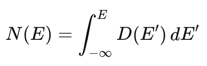

# Density of states calculation
In the context of DFT, the density of states (DOS) is a measure of how many energy levels are available for electrons at a given energy (or in a given energy range). It is a key concept in understanding a material's electronic structures as it determines the magnetism, conductivity, and so on. The DOS D(E) at a specific energy E is defined as


<!--  -->

i.e. it involves an integral over the Brillouin zone of a Dirac delta function that picks out the contribution of electronic states ε<sub>k</sub> at energy E. 

Calculation of the DOS is straightforward with quantum-ESPRESSO, and involves three distinct steps: 
1. SCF calculation with `pw.x`. The ground state electronic charge density is computed with `pw.x` self-consistently, as before, on a sufficiently dense k-point grid. 
2. NSCF calculation with `pw.x`. A non-self-consistent (NSCF) calculation is performed using `pw.x` over a much denser k-point grid and over a larger range of bands (to cover the energy range we are interested in). 
3. DOS calculation with `dos.x`. The DOS is computed using the `dos.x` code by carefully integrating the above expression. 

In practice the integral is replaced by a sum over (special) k-points:


<!--  -->

In this tutorial we will examine two ways of performing the integration.

  1. Run the self-consistent calculation using the provided input `si.scf.in` to generate the ground state electronic charge density. As before, we use an automatically 
  generated, regularly spaced, shifted k-point grid:
      ```
      % tail -2 si.scf.in 
      K_POINTS {automatic}
      8 8 8 1 1 1

      % pw.x < si.scf.in > si.scf.out
      ```
      As this is a SCF run, we set `calculation = 'scf'` in the input file.
      We have chosen 5 bands as before, with 4 being filled.

  2.  Run the non-self-consistent (NSCF) calculation using the provided input `si.nscf.in` to generate a set of eigenvalues and eigenfunctions on specific k-points of the Brillouin zone. There are two important changes to the input file:
      ```
      calculation = 'nscf'
      nbnd        = 10
      [...] 
      K_POINTS {automatic}
      8 8 8 0 0 0
      ```
      
      We thus request several empty bands (6) in addition to the filled (4) ones, like for the band structure calculation. In practice, the number of bands defines the range over which the DOS is computed, so typically one wants to include several eV above the CBM. 
      ```
      % pw.x < si.nscf.in > si.nscf.out
      ```
      Look quickly at the last eigenvalue for a few k-points: it is about 14 eV. 

      Note that we also specify an 8x8x8 _unshifted_ grid. Shifted grids were more efficient before. Why choose an unshifted one now?
      Since we want to compare and align the DOS with the band structure, it will be useful to ensure the gamma point is included in our grid.
  
  3.  Now we compute the DOS. For this we use a different executable called `dos.x`, which reads a short input file containing a single `&dos` namelist. For detailed explanation of the input file options see the documentation for [DOS](http://https://www.quantum-espresso.org/Doc/INPUT_DOS.html). 
      ```
      &dos
      outdir='./tmp'
      prefix='Si'
      fildos='si.dos.dat',
      degauss=0.01
      Emin=-10.0, Emax=20.0, DeltaE=0.1
      /
      ```
      The last line determines the range over which D(E) is computed, and on what energy intervals (in eV).
      
      By specifying `degauss` we indicate that the Dirac delta function above is replaced by a _Gaussian_ g<sub>σ</sub>. In this way we smooth out any sharp singularities appearing in the delta function, which will aid numerical stability. Here we use a gaussian broadening of 0.01 Ry = 0.13eV (NB: Ry, not eV). This parameter (σ) determines how many neighboring eigenvalues will contribute to the DOS at a given E. The integration is then approximated as a sum over (special) k-points.  

      
      
      
      Run the `dos.x` executable (also in parallel)
      ```
      % dos.x < si.dos.in > si.dos.out
      ```
      The output file `si.dos.dat` can be plotted.

      

      Note the format of the `si.dos.dat` file:
      ```
      % head si.dos.dat 
      #  E (eV)   dos(E)     Int dos(E) EFermi =    6.214 eV
      -10.000  0.1148E-84  0.1148E-85
      -9.900  0.1148E-84  0.2295E-85
      ```
      i.e., the file contains both the DOS and the integrated DOS N(E).

      

      What values do the DOS and the integrated DOS have at the Fermi level? Why?
      Understand the difference between Emax=20.0 and the value of the highest eigenvalue, and the effect of the choice of nbnd.

      Note: the NSCF run recalculates the Fermi level.

  5.  Clearly, the computed DOS distribution (in black) is not a smooth curve. Can you understand why this is by looking at the formulae above? We need to improve the integration by increasing the number of k-points. First, however, lets try to use an improved integration algorithm, the tetrahedron method. In this scheme the Brillouin zone is divided into small meshes that are further divided into tetrahedra. Within each tetrahedron, the eigenvalues ε<sub>k</sub> (and if present, the matrix elements M(k); for the DOS M(k)=1) are linearly or quadratically interpolated and as a result, the BZ integration can be done analytically. 

      

      To use this method, you just need to modify the input file slightly:
      ```
      % cat si.dos-tetra.in
      &dos
      outdir='./tmp'
      prefix='Si'
      bz_sum='tetrahedra'
      fildos='si.dos-tetra.dat',
      Emin=-10.0, Emax=20.0, DeltaE=0.1
      /
      ```
      
      Note there is no definition now of a smearing energy, but a new variable `bz_sum='tetrahedra'` (Other options are available). 
      
      Run `dos.x < si.dos-tetra.in > si.dos-tetra.out` again and compare with the previous plot (see above). 

      Clearly the tetrahedron method is better for obtaining a smooth DOS distribution (spectrum). This is generally true, but may not be adequate for metals with a complicated Fermi surface.

      Note: in principle, or at least in older versions of QE, one should also perform the nscf calculation using the tetrahedron method.
 
  6.  Let's now perform a convergence test with k-points. Increase the density of the k-point mesh in the NSCF run, using grids of size 8x8x8, 16x16x16 and 24x24x24. Save the output file `si.dos.dat` file with an appropriate name in each case. There should be no need to rerun the SCF calculation. For instance,
      ```
      sed 's/8 8 8/16 16 16/' si.nscf.in > si.nscf.in_k16
      pw.x < si.scf.in_k16 > si.scf.out_k16
      dos.x < si.dos.in > si.dos.out
      mv si.dos.dat si.dos.dat_k16
      ```
      Note that for larger grids, you should run in parallel, e.g. `mpirun -np 2 pw.x` and `mpirun -np 2 dos.x`  

      Repeat using the tetrahedron method, and satisfy yourself you have a well converged spectrum.

      Question: why do we need such a large density of k-points for computing the DOS, while a smaller grid is fine for the charge density?

  7.  Finally, compare the converged DOS with the band structure computed in the previous tutorial. Take care to align the top of the valence band in each case, as the Fermi level is defined differently, as you have seen above. You should also invert the columns (to have Energy on the vertical axis). In gnuplot:
      
      ```
      gnuplot> VBM=6.214
      gnuplot> plot "DOS_converged.dat" u 2:($1-VBM) with filledcurves y1 linecolor "red" fillcolor "red"
      ```
      Plotting more than one panel with gnuplot, is however, tricky. You can have a look at `Ref/Si_bands_DOS.gnuplot`.   

      
  
  8. ADVANCED: Try changing the values of the gaussian smearing and energy interval DeltaE, and observe the effect on the computed DOS. Try also `bz_sum='tetrahedra_opt'` and see which is more efficient.
      
  9. ADVANCED: You can also use the scripts 'run_dos' and 'run_plots' which will automate all the steps above. Look also at the 'EFermi.dat' file, which collects some information about the Fermi level and band edges. 
      ```
      % ./Scripts/run_dos
      % cat EFermi.dat
      % ./SCripts/run_plots
      ```
## Bibliography
1.  Aroyo et al, Acta Cryst. (2014). A70, 126-137 [Link](https://doi.org/10.1107/S205327331303091X)
