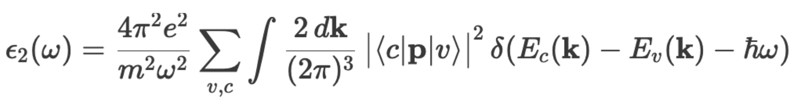
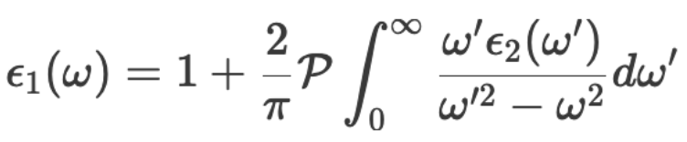
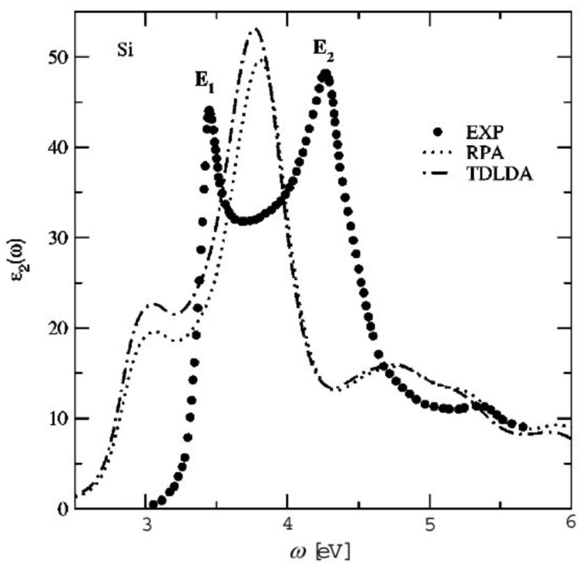

# Optical spectra calculation (UNDER CONSTRUCTION)

The optical spectra (dielectric functions) can be computed (at the independent particle level) using the tools `epsilon.x` and `pw2gw.x`. Remember that Kohn-Sham DFT is fundamentally a ground state theory and thus calculation of excited state properties such as optical excitations must be viewed as a first approximation. (For a better treatment, check out TDDFT and GW-BSE approaches.)

The dielectric function is computed from the KS bandstructure using an expression like:



<!--  -->

i.e. like the DOS it involves an integral over the Brillouin zone of a Dirac delta function times the dipole/momentum transition matrix elements. 

Calculation of the dielectric function involves three distinct steps: 

1. SCF calculation with `pw.x`. The ground state electronic charge density is computed with `pw.x` self-consistently, as before, on a sufficiently dense k-point grid. 
2. NSCF calculation with `pw.x`. A non-self-consistent (NSCF) calculation is performed using `pw.x` over a much denser k-point grid and over a larger range of bands (to cover the energy range we are interested in). 
3. Dielectric function calculation with `epsilon.x` or `pw2gw.x`. In practice the integral is replaced by a sum over (special) k-points.

In practice, the calculation requires careful convergence with bands and k-points. It is easy to end up running large and slow calculations that generate large amount of data. Thus it is _very_ important to organise the files neatly. Use separate directories for different numbers of k-points and bands. 

NB: currently only norm conserving pseudopotentials are supported, by either code (e.g. FHI, DOJO, GBRV).

In this tutorial we will examine the functionality of both codes and pay careful attention to convergence.

  1. Run the self-consistent calculation using the provided input `si.scf.in` to generate the ground state electronic charge density. As before, we use an automatically  generated, regularly spaced, shifted k-point grid:
      ```
      % tail -2 si.scf.in 
      K_POINTS {automatic}
      8 8 8 1 1 1

      % pw.x < si.scf.in > si.scf.out
      ```
      As this is a SCF run, we set `calculation = 'scf'` in the input file.
      We have chosen 5 bands as before, with 4 being filled.

### Calculation using epsilon.x

  2.  We will start with `epsilon.x` as it gives direct access to the real part ɛ1. Run the non-self-consistent (NSCF) calculation using the provided input `si.nscf-epsilon.in` to generate a set of eigenvalues and eigenfunctions on specific k-points of the Brillouin zone. There are several important changes to the input file:
      ```
      &CONTROL
      calculation = 'nscf'
      outdir       = "./tmp_epsilon"        <- we keep the SCF calculation separate (to be safe)
      [...]
      &SYSTEM
      nosym=.true.                          <- symmetries are not allowed with epsilon.x
      noinv=.true.
      nbnd        = 8                       <- we need some empty states
      [...]
      &ELECTRONS
       diago_full_acc=.true.                <- we want the empty states computed as accurately as the filled ones
       diago_thr_init=1.D-10
      [...] 
      K_POINTS {automatic}
      8 8 8 1 1 1                           <- shifted, large grid
      ```
      
      We thus request several empty bands (4) in addition to the filled (4) ones. The number of bands will determine the range over which single particle transitions are included. In practice, we will have to converge this value. As a rule of thumb, it should be at least double the number of occupied states.
      ```
      
      % cp -r tmp tmp_epsilon              <- copy the SCF charge density
      % pw.x < si.nscf-epsilon.in > si.nscf-epsilon.out
      ```
  
  3.  Now we compute the optical spectra with `epsilon.x`. For detailed explanation of the input file options see the documentation in PDF form distributed with the code (PP/Doc/eps_man.pdf) [PDF](https://gitlab.com/QEF/q-e-gpu/-/blob/17c12a1179ab1eede2f01eb4a8b11d1066095a7f/PP/Doc/eps_man.pdf). 
      ```
      &inputpp
        calculation = "eps"
        prefix       = "Si",
        outdir       = "./tmp_epsilon",
      /
      &energy_grid
        smeartype = "gauss"
        intersmear = 0.1
        wmin =  0.05
        wmax = 20.05
        nw = 201
      /
      ```
      The last line determines the range over which D(E) is computed, and on what energy intervals (in eV).
      Plot the resulting files "epsi_Si.dat" and "epsr_Si.dat"
      ```
      gnuplot> plot "epsi_Si.dat" w l,"epsr_Si.dat" w l
      ```

   4. Let's first carry out a convergence test on the number of bands. Repeat steps 2 and 3 for a range `nbnd = (5,8,12,16)`.
      
      You can automate the process using the provided shell scripts, e.g.
      ```
      % ./Scripts/run_epsilon_bands
      % ./Scripts/run_plots_epsilon_bands
      ```

      

      There are two ways the spectra are influenced by the number of bands.
      
      - For the imaginary part, a low value of nbnd truncates the possible v-c transitions appearing in the equation above, so that e2 goes to zero after several eV. For the energy range shown, convergence seems to be reached at 12 bands (i.e. vb=4 <-> cb 8)  
      - For the real part, the spectral convergence is qualitatively similar, but we can also check explicitly the value of the dielectric constant at 0 eV:

      ```
      % grep -A2 "energy grid" epsilon_script_b*/epsr_Si.dat
      epsilon_script_b5/epsr_Si.dat:# energy grid [eV]     epsr_x  epsr_y  epsr_z
      epsilon_script_b5/epsr_Si.dat-    0.050000000   11.418133585   11.410096239   11.415220253
      epsilon_script_b8/epsr_Si.dat-    0.050000000   15.687396360   15.687396587   15.687396329
      epsilon_script_b12/epsr_Si.dat-   0.050000000   15.908717170   15.908714339   15.908720982-
      epsilon_script_b16/epsr_Si.dat-   0.050000000   15.923107285   15.923107359   15.923107988
      ````
      Conpare with the experimental value for Si of 11.7.

      The real and imaginary parts are not independent; in fact they are linked by the Kramers-Kronig transform

      

      From this expression is it clear why ɛ2(0) depends on the number of bands/transitions included in computing ɛ1.

      In any case, we take 12 bands to have well converged spectra. (However, check "eels_Si.dat" for a more sensitive convergence!).

  6. Next we test the convergence with k-points.

      ```
      % ./Scripts/run_epsilon_kpts
      % ./Scripts/run_plots_epsilon_kpts
      ```


For the broadening (smearing) chosen (0.1eV), convergence for (32x32x32) grid is good, but not perfect, especially over 4eV. Indeed to have a perfectly smooth curve, one should use a random k-point sampling to avoid spurious peaks from the use of a regular grid.

It is interesting to compare with the case of an unshifted grid, which has the same number of k-points (no symmetry)


Clearly a shifted grid is much better choice in this case.

### Calculation using pw2gw.x

6. Last we can repeat the analysis with the `pw2gw.x` code. The main difference here is that the summations over k are performed over the irreducible Brillouin zone, so larger k-point meshes can be used. In this case, however, only the trace of the dielectric tensor is valid.

There is no broadening used in `pw2gw.x`, only a step size. As a result, the raw spectra are very noisy, so one could convolute the spectra with e.g. gaussian. However, it is straightforward to smooth the spectra with gnuplot.

    ```
    % cp -r tmp tmp_pw2gw
    % pw.x < si.nscf-pw2gw.in > si.nscf-pw2gw.out
    % pw2gw.x < si.pw2gw.in > si.pw2gw.out
    % plot "epsTOT.dat" w l,"" u 1:2:(1000) smooth acsplines 
    ```
Again, the k-point convergence must be checked (there is no need to repeat the convergence on bands). Use the provided scripts as necessary.

    ```
    % ./Scripts/run_pw2gw_kpts
    % ./Scripts/run_plots_pw2gw_kpts
    ```
      

Comparing the spectrum with experiment, one finds a pretty large discrepancy.


 
## Bibliography
1.  Aroyo et al, Acta Cryst. (2014). A70, 126-137 [Link](https://doi.org/10.1107/S205327331303091X)
