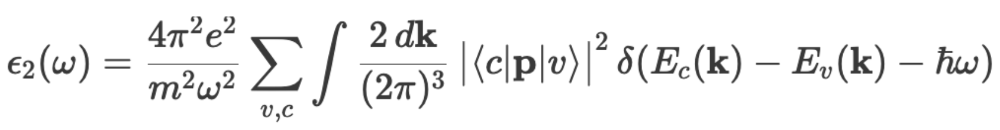
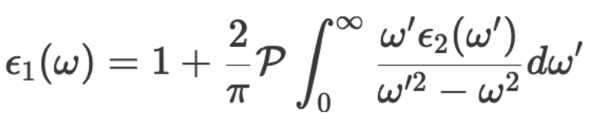
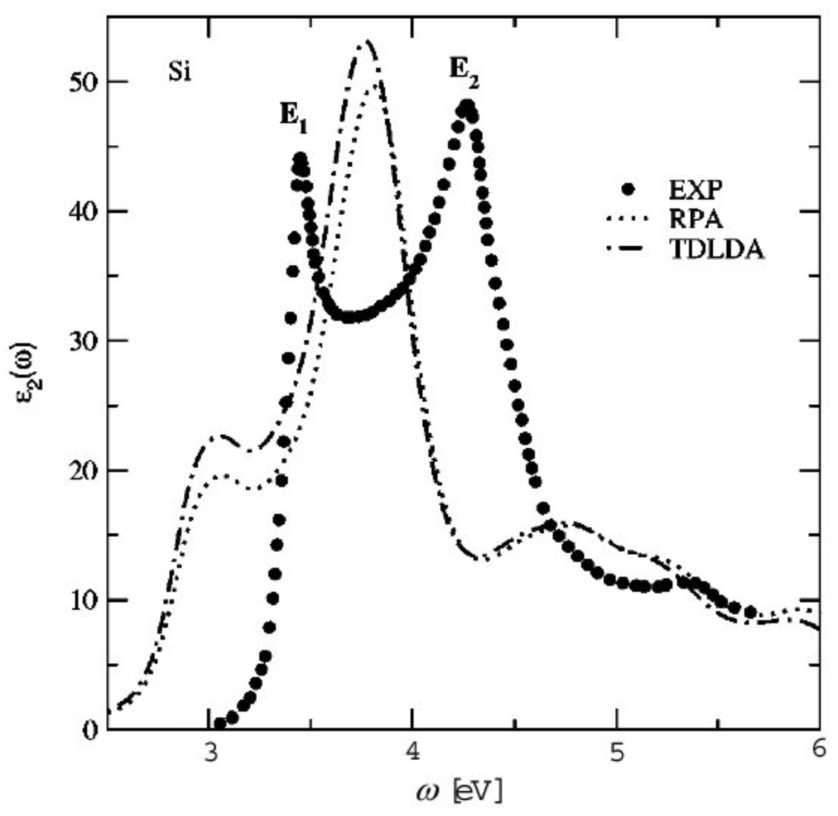
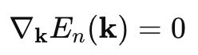

# Optical spectra calculation

The optical spectra (dielectric functions) can be computed (at the independent particle level) using the tools `epsilon.x` and `pw2gw.x`. Remember that Kohn-Sham DFT is fundamentally a ground state theory and thus calculation of excited state properties such as optical excitations must be viewed as a first approximation. (For a better treatment, check out TDDFT and GW-BSE approaches.)

The dielectric function is computed from the KS bandstructure using an expression like:



<!--  -->

i.e. like the DOS it involves an integral over the Brillouin zone of a Dirac delta function times the dipole/momentum transition matrix elements. The _Enk_ are the Kohn-Sham eigenvalues for band index _n_ and k-point index _k_; the |nk> are the relative Kohn-Sham eigenstates.

Calculation of the dielectric function involves three distinct steps: 

1. SCF calculation with `pw.x`. The ground state electronic charge density is computed with `pw.x` self-consistently, as before, on a sufficiently dense k-point grid. 
2. NSCF calculation with `pw.x`. A non-self-consistent (NSCF) calculation is performed using `pw.x` over a much denser k-point grid and over a larger range of bands (to cover the energy range we are interested in). 
3. Dielectric function calculation with `pw2gw.x` or `epsilon.x`. In practice the integral is replaced by a sum over (special) k-points.

Like DOS, calculation of optical spectra requires careful convergence with bands and k-points. It is easy to end up running large and slow calculations that generate large amount of data. Thus it is _very_ important to organise the files neatly. Use separate directories for different numbers of k-points and bands. 

> [!NOTE]
> Currently only norm conserving pseudopotentials are supported, by either code (e.g. FHI, DOJO, GBRV).

In this tutorial we will examine the functionality of both codes and pay careful attention to convergence.

### Calculation using pw2gw.x

  1. The benefit of `pw2gw.x` over `epsilon.x` is that it is easier to converge spectra. The summations over k are performed over the irreducible Brillouin zone (IBZ), allowing dense k-point meshes to be used. Since the trace of the dielectric tensor ɛ=(ɛ<sub>xx</sub>+ɛ<sub>yy</sub>+ɛ<sub>zz</sub>)/3 is invariant under crystal symmetry operations, we can compute it using an IBZ summation. This is perfect for computing the optical spectrum of an isotropic material like bulk silicon.
    
     Run the self-consistent calculation using the provided input `si.scf-pw2gw.in` to generate the ground state electronic charge density. 
     As before, we use an automatically  generated, regularly spaced, shifted k-point grid:
      ```
      % cat si.scf-pw2gw.in
      outdir       = "./tmp_pw2gw",
      nbnd      = 5
      [...]
      K_POINTS {automatic}
      8 8 8 1 1 1

      % pw.x < si.scf-pw2gw.in > si.scf-pw2gw.out
      ```
      As this is a SCF run, we set `calculation = 'scf'` in the input file.
      We have chosen 5 bands as before, with 4 being filled.

  2. Run the non-self-consistent (NSCF) calculation using the provided input `si.nscf-pw2gw.in` to generate a set of eigenvalues and eigenfunctions on specific k-points of the Brillouin zone. There are several important changes to the input file:

      ```
      &CONTROL
      calculation = 'nscf'
      outdir       = "./tmp_pw2gw"        <- we will keep the SCF calculation separate (to be safe)
      [...]
      &SYSTEM
      nbnd        = 10                       <- we need some empty states
      [...]
      &ELECTRONS
       diago_full_acc=.true.                <- we want the empty states computed as accurately as the filled ones
       diago_thr_init=1.D-10
      [...] 
      K_POINTS {automatic}
      16 16 16 1 1 1                           <- large grid
      ```
      
      We thus request several empty bands (6) in addition to the filled (4) ones. The number of bands will determine the range over which single particle transitions are included. In practice, we will have to converge this value. As a rule of thumb, it should be at least double the number of occupied states.
     
      Make a copy of the SCF charge density to make sure things stay consistent, and run the code to generate the KS eigenvalues and eigenvectors on the dense grid.  
      ```
      % cp -r tmp tmp_pw2gw                               <- copy the SCF charge density
      % pw.x < si.nscf-pw2gw.in > si.nscf-pw2gw.out       <- use mpirun if possible
      ```

  3.  Now we compute the imaginary part of the dielectric function with `pw2gw.x`. 

      Inspect the input file, `si.pw2gw.in`, run the code, and plot the output file `epsTOT.dat`. The input is quite straightforward, containing only the range we want to plot, and a step size (in eV). 

      ```
      % cat si.pw2gw.in
      &inputpp
        prefix       = "Si",
        outdir       = "./tmp_pw2gw",
        Emin=0.0
        Emax=20.0
        DeltaE=0.1
      /
      % pw2gw.x < si.pw2gw.in > si.pw2gw.out
      gnuplot> plot "epsTOT.dat" w l
      ```

      There is no broadening used in `pw2gw.x`, only a step size 'DeltaE'. As a result, the raw spectra are very noisy. One could convolute the spectra with a gaussian. 
      However, it is straightforward to smooth the spectra with gnuplot: from `gnuplot> help smooth` a good option is using acsplines (approximate cubic splines) to fit the data; 
      the smoothing factor can be read from a third column or set manually (here 1000; try other values) like in the following.
      ```
      % plot "epsTOT.dat" w l,"" u 1:2:(1000) smooth acsplines 
      ```
> [!WARNING]
> The code also generates `epsX.dat`,`epsY.dat`, and `epsZ.dat`, which are the diagonal elements of the dielectric tensor. Compare them to the trace, `epsTOT.dat`. Are they what you expect?
> Try running the nscf (+pw2gw) code again with `nosym=.true.` in the input file.


    
  5.  The `pw2gw.x` code only writes the imaginary part of the dielectric function. However, the real and imaginary parts are not independent; in fact they are linked by the Kramers-Kronig transform:

      
    
      In the `../../Codes` folder there is a simple Fortran90 routine for computing the real part. 
      If the executable `KK_driver.x` is not already in your path (try `which KK_driver.x`), you will need to compile it first (this is necessary for the bash scripts):
      ```
      % cd ../../Codes
      % gfortran KK_driver.f90 -o KK_driver.x
      % cd -
      % ../../KK_driver.x
      ```
      The code runs interactively and asks you for the filename (e.g. `epsTOT.dat`) and a suitable broadening (e.g. 0.1 eV). Assuming it all goes well, it generates a plottable file `spectrum.dat`:
      ```
      % gnuplot> plot "spectrum.dat" u 1:2 t "Real" w l,"" u 1:3 t "Imag" w l
      ```
      As well as generating the real part, and hence the dielectric _constant_, this code is thus an alternative way to apply a broadening to the original `epsTOT.dat` file (Lorentzian in this case). 

      

  6.  Optical spectra, like DOS, are very sensitive to the band range and k-grid density. Do you understand why? 
  
      Let's first carry out a convergence test on the number of bands. Repeat steps 2--4 for a range `nbnd = (5,8,12,16)`, saving the output files with different names each time, e.g.
      ```
      % vi si.nscf-pw2gw.in            <- change nbnd = 8
      % pw.x < si.nscf-pw2gw.in > si.nscf-pw2gw.out
      % pw2gw.x < si.pw2gw.in > si.pw2gw.out
      % ../../KK_driver.x
      epsTOT.dat 0.1
      % mv spectrum.dat spectrum.dat_b8
      ```

      

      There are two ways the spectra are influenced by the number of bands:
      
      - For the imaginary part, a low value of nbnd truncates the range of possible v-c transitions appearing in the ɛ<sub>2</sub> equation above, so that ɛ<sub>2</sub> goes to zero after several eV. 
      For the energy range shown, convergence seems to be reached at 12 bands (i.e. vb=4 <-> cb 8)  
      - For the real part, the spectral convergence is qualitatively similar, but we can also check explicitly the value of the dielectric constant at 0 eV:

      | nbnd | Re[ɛ(0)] |
      | --- | --- | 
      | 5 | 11.405 | 
      | 8 | 15.675 |
      | 12 | 15.895 |
      | 16 | 15.906 |

      Compare with the experimental value for Si of 11.7.

  7. Finally, the k-point convergence must be checked. For optical spectra this is _crucial_! Increase the kgrid from 8x8x8, to 16x, 32x, 64x ...  Use the provided scripts as necessary.

    ```
    % ./Scripts/run_pw2gw_kpts
    % ./Scripts/run_plots_pw2gw_kpts
    ```
     


  8. If we compare the spectrum computed with DFT against experiment, we find pretty large discrepancies. Where do you think the errors lie, and which is most important?

  

> [!TIP]
> Since `pw2gw.x` and `dos.x` both need large k-point grids in the IBZ, you can calculate both `epsTOT.dat` and `dos.dat` with the same NSCF run. Just make sure to set the `tmpdir` correctly.


### Calculation using epsilon.x

  1.  As an alternative, one can use the `epsilon.x` code. On the negative side, one _must_ switch off symmetries, meaning that convergence is very slow with k-points. On the positive side, it gives direct access to both real and imaginary parts, computes correctly all elements of the dielectric tensor, treats spin-polarized systems correctly, and computes also the joint density of states, electron energy loss function (EELS), and intraband/metallic transitions. There is also a more complete manual in PDF distributed with the code (`PP/Doc/eps_man.pdf`) [PDF](https://gitlab.com/QEF/q-e-gpu/-/blob/17c12a1179ab1eede2f01eb4a8b11d1066095a7f/PP/Doc/eps_man.pdf).

      Run the non-self-consistent (NSCF) calculation using the provided input `si.nscf-epsilon.in` to generate a set of eigenvalues and eigenfunctions on specific k-points of the Brillouin zone. 
      There are several important changes to the input file:
      ```
      &CONTROL
      calculation = 'nscf'
      outdir       = "./tmp_epsilon"        <- we keep the SCF calculation separate (to be safe)
      [...]
      &SYSTEM
      nosym=.true.                          <- symmetries are not allowed with epsilon.x
      noinv=.true.
      nbnd        = 8                       <- we need some empty states
      [...]
      &ELECTRONS
       diago_full_acc=.true.                <- we want the empty states computed as accurately as the filled ones
       diago_thr_init=1.D-10
      [...] 
      K_POINTS {automatic}
      8 8 8 1 1 1                           <- shifted, large grid
      ```
      
      We thus request several empty bands (4) in addition to the filled (4) ones. The number of bands will determine the range over which single particle transitions are included. In practice, we will have to converge this value. As a rule of thumb, it should be at least double the number of occupied states.
      ```
      
      % cp -r tmp tmp_epsilon              <- copy the SCF charge density
      % pw.x < si.nscf-epsilon.in > si.nscf-epsilon.out
      ```
  
  2.  Now we compute the optical spectra with `epsilon.x`. 
      ```
      &inputpp
        calculation = "eps"
        prefix       = "Si",
        outdir       = "./tmp_epsilon",
      /
      &energy_grid
        smeartype = "gauss"
        intersmear = 0.1
        wmin =  0.05
        wmax = 20.05
        nw = 201
      /
      ```
      The last line determines the range over which D(E) is computed, and on what energy intervals (in eV).
      Plot the resulting files "epsi_Si.dat" and "epsr_Si.dat"
      ```
      gnuplot> plot "epsi_Si.dat" w l,"epsr_Si.dat" w l
      ```

   3. Let's first carry out a convergence test on the number of bands. Repeat steps 2 and 3 for a range `nbnd = (5,8,12,16)`.
      
      You can automate the process using the provided shell scripts, e.g.
      ```
      % ./Scripts/run_epsilon_bands
      % ./Scripts/run_plots_epsilon_bands
      ```

      

      There are two ways the spectra are influenced by the number of bands.
      
      - For the imaginary part, a low value of nbnd truncates the possible v-c transitions appearing in the equation above, so that e2 goes to zero after several eV. For the energy range shown, convergence seems to be reached at 12 bands (i.e. vb=4 <-> cb 8)  
      - For the real part, the spectral convergence is qualitatively similar, but we can also check explicitly the value of the dielectric constant at 0 eV:

      ```
      % grep -A2 "energy grid" epsilon_script_b*/epsr_Si.dat
      epsilon_script_b5/epsr_Si.dat:# energy grid [eV]     epsr_x  epsr_y  epsr_z
      epsilon_script_b5/epsr_Si.dat-    0.050000000   11.418133585   11.410096239   11.415220253
      epsilon_script_b8/epsr_Si.dat-    0.050000000   15.687396360   15.687396587   15.687396329
      epsilon_script_b12/epsr_Si.dat-   0.050000000   15.908717170   15.908714339   15.908720982-
      epsilon_script_b16/epsr_Si.dat-   0.050000000   15.923107285   15.923107359   15.923107988
      ````
      Conpare with the experimental value for Si of 11.7.

      The real and imaginary parts are not independent; in fact they are linked by the Kramers-Kronig transform

      

      From this expression is it clear why ɛ1(0) depends on the number of bands/transitions included in computing ɛ2.

      In any case, we take 12 bands to have well converged spectra. (However, check "eels_Si.dat" for a more sensitive convergence!).

  4.  Next we test the convergence with k-points. Modify the k-grid by hand, or use the scripts provided. Since the number of k-points increases dramatically now (8<sup>3</sup>, 16<sup>3</sup>, etc), it is essential to run in parallel and to have adequate resources available...

      ```
      % ./Scripts/run_epsilon_kpts
      % ./Scripts/run_plots_epsilon_kpts
      ```
      
      

      For the broadening (smearing) chosen (0.1eV), convergence for (32x32x32) grid is good, but not perfect, especially over 4eV. Indeed to have a perfectly smooth curve, one should use a random k-point sampling to avoid spurious peaks from the use of a regular grid.

      It is interesting to compare with the case of an unshifted grid, which has the same number of k-points (no symmetry)

      

      Clearly a shifted grid is much better choice in this case.


### Analyse the optical spectrum

Compare the computed dielectric function e2 with the computed band structure and DOS. What are the connections between them?

- The onset in e2 will occur at the minimum (direct) band gap
- Peaks occur when transitions are between parallel bands, i.e. many transitions are possible at the same photon energy. These correspond to the van Hove singularities at critical points, where  . Use `epsilon.x` to plot also the joint density of states (JDOS). 
- Strength of the peak (oscillator strength) will depend also on the transition matrix elements
- If using `epsilon.x`, also intraband excitations can be simulated.

## Bibliography
1.  Aroyo et al, Acta Cryst. (2014). A70, 126-137 [Link](https://doi.org/10.1107/S205327331303091X)
