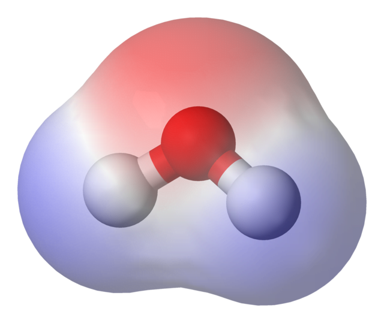
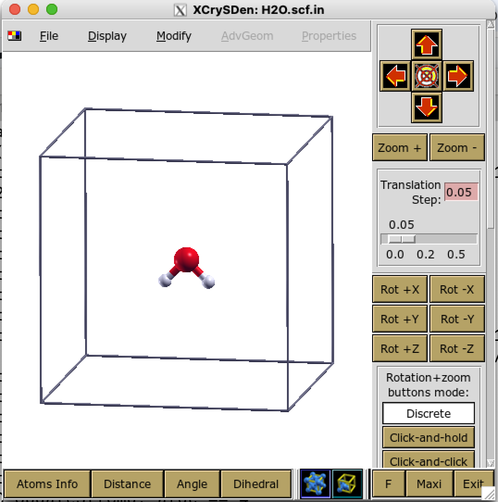

# The water molecule: basic calculation

In this first tutorial we consider a familiar system: the water (H2O) molecule.
We will show how to set up a simple input file to compute the ground state electronic properties with quantum-ESPRESSO.



## Outline
1. Input file for a simple molecule
2. Visualize the system with XCrysDen
3. Run the code
4. Understand the output: number of electrons, bands, HOMO-LUMO gap, symmetries

### Input file

For this tutorial we will work in the '0_start' folder:
```
% cd 0_water/0_start
```
1.First look at the provided 'H2O.scf.in' file. 
In any calculation, the first thing we need to know is the number and type of atoms. 
For the water molecule, that's easy: 2 hydrogens and 1 oxygen, so 3 atoms of 2 different types, 
defined inside the &SYSTEM namelist:
```
% cat H2O.scf.in
[...]
&SYSTEM
ntyp = 2,
nat  = 3,
/
[...]
```

2. To simulate an isolated molecule, we place it in a large empty box. Later we will examine in more detail what size and form the box must take (bear in mind we have a periodic supercell, not an isolated box!), but for now let's just take a cubic box of length about 8 A. We can do this by explicitly defining the three  orthogonal lattice vectors in an "input card" called `CELL_PARAMETERS` together with `ibrav = 0`:
```
% cat H2O.scf.in
ibrav     = 0,
[...]
CELL_PARAMETERS {angstrom}
8.0  0.0  0.0
0.0  8.0  0.0
0.0  0.0  8.0
[...]
```
An alternative way to define a cubic cell is by setting `ibrav=1`, which defines a simple cubic Bravais lattice, and defining the cell length `A` in Angstrom:
```
ibrav     = 1,
A         = 8.0
```
In this case, the `CELL_PARAMETERS` block should not also be present, otherwise the code will complain.

3. Let's now define a *starting* geometry for our water molecule. 
We know that water is not linear, like CO2, but is bent. For simplicity, let's assume an internal angle of 90 degrees.
How long are the H-O bonds? Typical covalent/ionic bond lengths are in the 1-2 angstrom range: let's assume the bond length is about 1 A.
We also know the molecule is symmetric, so let's set it up like an inverted "V" shape, with the O atom in the middle of the cell, and the molecule in the X-Z plane. (This choice is not crucial, but has some advantages - and is the usual way the water molecule is represented.)
The atomic coordinates are written in units of Angstrom in an `ATOMIC_POSITIONS` input card:
```
ATOMIC_POSITIONS {angstrom}
H  3.3  4.0  4.7    
O  4.0  4.0  4.0    
H  4.7  4.0  4.7  
```
The other settings in the input file we will explain later. 

### Visualization

4. Let's now visualize our input file using `xcrysden`.
```
% xcrysden --pwi H2O.scf.in
```
Here `--pwi` means "PWscf input file format". (You can also choose to read a PWscf input file from XcrysDen main menu).
Click OK until you see the molecule inside a box: zoom in, rotate it, play with the menu options. 



When ready, measure the *bond length* and the *internal angle* using the tools below the image, and check they are consistent with the initial choices above.

### Run the code

5. If everything looks good, we can run a first simulation with quantum-ESPRESSO. In the `&CONTROL` namelist we set the type of calculation we want: 
```
  calculation  = "scf",
```
For now, let's just calculate some basic ground state properties for water in this approximate water geometry. To launch the code, type:
```
% pw.x < H2O.scf.in    [ENTER]
[...]
=------------------------------------------------------------------------------=
     JOB DONE.
=------------------------------------------------------------------------------=
```
Launched in this way the output is written quickly to screen. You can scroll back to read the lines, or run it again and redirect the output to a file, e.g.
```
% pw.x < H2O.scf.in > H2O.scf.out
% less H2O.scf.out
```
If you have a parallel (MPI) environment set up correctly on your computer, you can also launch the run on several processors:
```
% mpirun -np 2 pw.x < H2O.scf.in > H2O.scf.out
```

### Examine the output 

6. Inspect the output file. The beginning reports the information about the system (number of atoms, lattice vectors, bands, etc), and the end of the file shows the self-consistent calculation of the ground state (total energy, eigenvalues, etc).


> [!TIP]
> **Always** confirm that the calculation terminated correctly by checking the PWscf output file. For an SCF calculation you should see messages like:
> ```
>   !    total energy              =     -34.30122626 Ry
>    convergence has been achieved in   X iterations
> ```


Find, or calculate, the following information (before checking the answers!):

* The number of electrons
* The number of energy levels/bands
* The number of symmetries
* How much RAM is needed
* The HOMO-LUMO gap
* The total energy
* The number of iterations needed to converge
* The time taken for the calculation
  

<details>
<summary> Answers (click to expand) </summary>

* There are **8 electrons** in our system. This is a little surprising, because O has 8 electrons in total, and H has 1, so we might expect 10 electrons. However, the 1s2 electrons in the O atom are accounted     for in the pseudopotential, and we only consider the valence electrons (6 for O: 1s²2s²2p⁴, and 1 for each H: 1s1).

```
% grep "total energy" H2O.scf.out
%grep scf H2O.scf.out
```

* There are **6 states** in our calculation. This was defined in the input file (`nbnd = 6`). 
The default value for an insulator is nelec/2 = number of occupied states (here, 4). We chose 6 explicitly in order to calculate the first empty states as well.
     
* The water molecule has **four** symmetry elements: the identity _E_, a twofold rotation axis C_2, and two vertical reflection planes sigma_{v}(xz) and sigma_{v}(yz). 
These elements correspond to the four symmetry operations of the molecule, which define its C_{2v} point group.

* The calculation needs about **50 MB of RAM**. 
```
Estimated max dynamical RAM per process >      50.83 MB`
```     

* The HOMO-LUMO gap is **5.91 eV**.  You can calculate this by inspecting the eigenvalues, or direcly from the line
```
highest occupied, lowest unoccupied level (ev):    -6.9983   -1.0880
```
For comparison, the experimental value is 6.3eV.
There is no _Fermi level_ reported if the system is an insulator/semiconductor.

* The **_final_ total energy** is reported in Rydberg atomic units (1 Ry = 13.6057eV = 0.5 Ha).
```
!    total energy              =     -34.04117898 Ry
```
Note that it's easy to search for the final total energy value using grep:
```
% grep ! H2O.scf.out
```
Also note that this value is, on its own, meaningless.

* The self-consistent field (SCF) loop took **6 iterations** to converge. You can track its progress towards convergence by grepping the total energy and its error (precision) at each iteration:
```
% grep "total energy" H2O.scf.out
% grep scf H2O.scf.out
```

* The calculation sook **about a second** (the exact value will depend on your computer) :
```
PWSCF        :      0.68s CPU      0.75s WALL
```
There are two timing values reported. The _CPU time_ is the calculation time according to the CPU, and can change with the number of processors. 
The _WALL time_, is the "Wall clock" time and is the total run time, including time taken reading and writing to disk. 

You can also deduce it from the start and end times of the calculation:
```
0_start % grep -e "starts on" -e "terminated on" pw.out     
Program PWSCF v.6.7MaX starts on 29Oct2025 at 10: 7:20 
This run was terminated on:  10: 7:20  29Oct2025    
```
     
</details>

Do any of these values surprise you? 


That's the basic idea of running PWSCF! 
Next, let's run the calculation properly, and compute some observable quantities.

### Further information
1.  PWscf input file parameters web page [Link](https://www.quantum-espresso.org/Doc/INPUT_PW.html)
2.  Point group symmetries of water [Link](https://chem.libretexts.org/Bookshelves/Inorganic_Chemistry/Inorganic_Chemistry_(LibreTexts)/04%3A_Symmetry_and_Group_Theory/4.03%3A_Properties_and_Representations_of_Groups/4.3.02%3A_Representations_of_Point_Groups)

