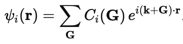
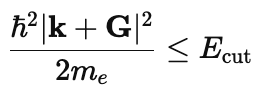
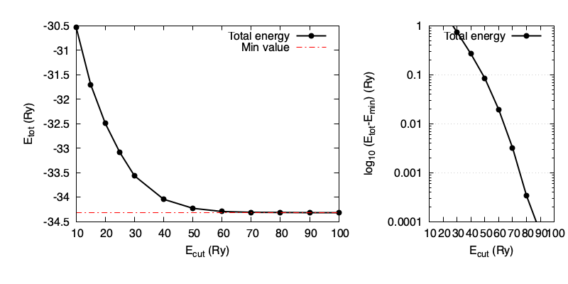
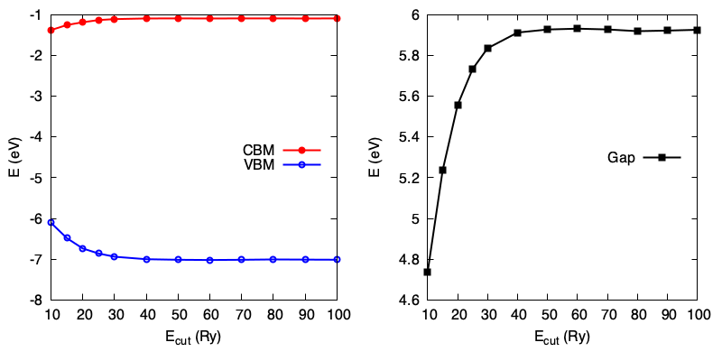
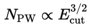
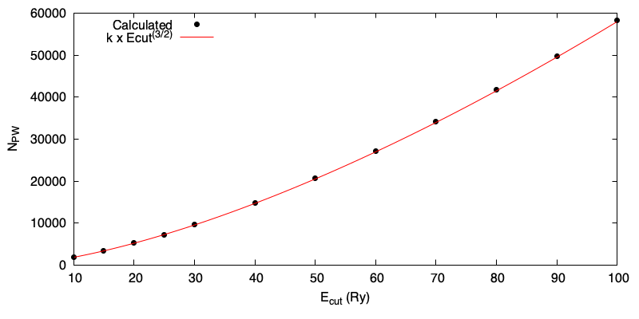

# Convergence of the basis set (kinetic energy cutoff)

In quantum-ESPRESSO, and other codes that use plane-waves as a basis set (e.g. VASP,Abinit,Castep), the (pseudo-) wavefunction is expanded over a set of plane-waves (G-vectors):



In principle one should use an infinite number of G-vectors. In practice, one truncates this expansion at some point, by including G-vectors up to some **|Gmax|**. However, instead of working in terms of **|Gmax|**, it is more useful to talk in terms of energy - specifically, the _kinetic energy_. 
The reason is that, for the same required precision, the same energy cutoff can be specified even if the cell size changes.

Using the expression for the kinetic energy of a planewave with wavevector |k+G| (you should be able to derive this!), we define the cutoff as the following:  



whereby we keep all G-vectors that satisfy this expression.
In quantum-ESPRESSO, this Ecut is determined by the parameter `ecutwfc`. 

Thus, we need to perform convergence tests to find an appropriate value of `ecutwfc`.
Determining this cut-off point is a crucial **first step** in any DFT calculation.

What cutoff to use depends on many factors, including:
* What elements are present (heavy/light/d-shells?)
* The pseudopotential choice (how many valence electrons?)
* What precision is required (what are you calculating?)
* The computational cost (what resources do you have?)


## Outline
1. Converge the kinetic energy cutoff with respect to the total energy
2. Converge the kinetic energy cutoff with respect to some observable
3. Understand the cutoff vs G-vector relation

## Running the exercise

1. We take again our H2O.scf.in input file. Remember, the geometry is still only a guess: nonetheless, it does not affect the following convergence study. In this file, the cutoff is set to a starting value of 10Ry.

Run the SCF calculation, redirecting the output to a file:
```
% pw.x < H2O.scf.in > H2O.scf.out_10Ry		[or]
% mpirun -np 2 pw.x < H2O.scf.in > H2O.scf.out_10Ry
```
2. Repeat step 1 and change each time the value of `ecutwfc` from 10 up to 100 Ry in steps of 10 Ry. 

Modify (edit with `vi` or your preferred editor) the 'H2O.scf.in' file and change `ecutwfc = 10` to `ecutwfc = 20`.

You can also make this change directly to the original input file using the `sed` command to replace the first occurrence of '10' with '20':
```
sed -e 's/10/20/' H2O.scf.in
```
Run the calculation, making sure to change the name of the _output_ file each time (so as to not overwrite it).
```
% pw.x < H2O.scf.in > H2O.scf.out_20Ry
```
Repeat for 10,20,30...100 Ry.
```
[...]
% pw.x < H2O.scf.in > H2O.scf.out_100Ry
```

### Analyse the total energy

3. Use `grep` to extract the final total energy from all files in one command using the wildcard *
```
% grep -e '!' *out*Ry
H2O.scf.out_10Ry:!    total energy              =     -15.77444885 Ry
H2O.scf.out_20Ry:!    total energy              =     -15.97444885 Ry
[...]
```
Copy and paste the cutoff energies and total energies into a 2 column file (Ecut,Etot) called 'Etot_vs_Ecut.dat' and plot it to see if you have reached convergence.
```
gnuplot> plot "Etot_vs_Ecut.dat" w l
```


At what cutoff do you think the total energy is converged? You might say "70Ry" based on where the graph _looks_ flat. But it's not flat! The total energy decreases monotonically with the cutoff (i.e. as the basis set gets more complete). You can see this in the log plot on the right. 

So, you should decide on some numerical threshold. 1mRy? 1meV? Per atom, or per formula unit? 

In short, the total energy is not a good criterion to use for testing convergence. In principle you should carry out convergence for the _physical property_ you are interested in.

> [!TIP]
> The cutoff will be determined by the 'hardest' pseudopotential used: in this case the oxygen.

### Analyse the electronic properties

4. Let's say we are mostly interested in the HOMO-LUMO gap of water.
In the previous tutorial we saw that the highest occupied/lowest unoccupied levels are reported explicitly in the output file. 
You can use `grep` on each file to extract the HOMO and LUMO, and compute the band gap using the `bc -l` program or a calculator.
``` 
% grep "highest" H2O_script.scf.out_Ecut10
     highest occupied, lowest unoccupied level (ev):    -6.1089   -1.3719
% echo "6.1089   -1.3719" | bc -l
4.7370
```
Create a 4 column file (Ecut, VBM, CBM, gap) called 'Gap_vs_Ecut.dat' and plot the gap versus the cutoff. 
How does the convergence compare with the value expected from the total energy run?



Regarding the HOMO-LUMO gap, the convergence behaviour is less smooth up to 100 Ry (any idea why?).
If we target a reasonable precision of 0.02 eV, an adequate cutoff is only 50Ry - much lower than the value we guessed before.

> [!TIP]
> Different quantities converge at different rates!
> There can be a large difference between variational convergence (total energy, forces) and spectral convergence (eigenvalues, DOS).

### More about G-vectors

5. By increasing the cutoff, we have increased the number of G-vectors. 
Inspect the output files again. How many G-vectors are used for expanding the _wavefunction_ in each run?  
     
<details>
<summary>Answer</summary>
The G-vector information is found in these lines:
     
```
     G-vector sticks info
     --------------------
     sticks:   dense  smooth     PW     G-vecs:    dense   smooth      PW
     Sum        2917    2917    725               118265   118265   14771
     [...]
     Dense  grid:    59133 G-vectors     FFT dimensions: (  64,  64,  64)
```
The number of planewaves needed to expand the _wavefunctions_ for this cutoff is 14771, while 59133 = 14771*4 is the number needed to expand the _charge density_.
</details>

Prepare a 2-column datafile (Ecut, #G-vectors) and convince yourself that the number of planewaves scales as . 
Can you guess where the factors 2 and 3 come from in the exponent?



6. As a last look under the hood, find the number of points in the FFT grid and work out the real-space resolution for a cutoff of 50 Ry.

<details>
<summary>Answer</summary>
     
* The FFT grid dimensions are reported on the same line as the dense grid, i.e. ( 72 x 72 x 72 )

* Since the cubic box length is 8A, the resolution in real space at this cutoff is 8A/72 = 0.1A, i.e. about 1/10 the length of the H-O bond.

</details>

### Scripts
For the impatient, the convergence tests above can be run via a simple bash script:
```
% ./Scripts/run_ecut
% ./Scripts/run_plots
```
Make sure you know how to run the code and understand error messages before attempting to use the scripts.  


