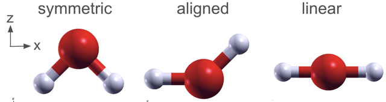
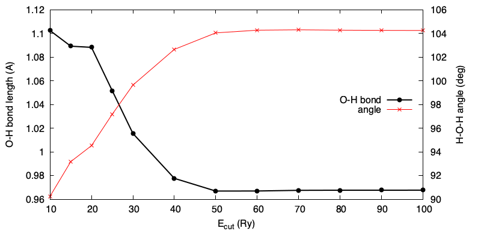

# Geometry optimization

In this tutorial we will compute the optimized geometry of the water molecule.



### Outline
1. Optimize the geometry of H2O
2. Converge the kinetic energy cutoff with respect to the geometry
3. Constrained optimization

### Running the exercise

1. Let's inspect the file 'H2O.relax_symmetric.in'. There are some new additions with respect to the previous run:
```
&CONTROL
  calculation  = "relax",         <-- New calculation type
  prefix       = "H2O",
  pseudo_dir   = "../../Pseudo",
  outdir       = "./tmp",
  verbosity    = 'high'
  tprnfor = .true.                <-- Print forces
/
&SYSTEM
  ibrav     = 0,
  nat       = 3,
  ntyp      = 2,
  nbnd      = 6,
  ecutwfc   = 60                <-- Set to 60 Ry
/
&ELECTRONS
/
&IONS                            <-- new NAMELIST
/

CELL_PARAMETERS {angstrom}
 8.0  0.0  0.0
 0.0  8.0  0.0
 0.0  0.0  8.0
ATOMIC_SPECIES
H  1.00  H_ONCV_PBE-1.2.upf
O  6.00  O_ONCV_PBE-1.2.upf 
ATOMIC_POSITIONS {angstrom}
H  3.3  4.0  3.3    
O  4.0  4.0  4.0   0 0 0          <-- oxygen atom is fixed
H  4.7  4.0  3.3 
K_POINTS {Gamma}
```

* The calculation type is now 'relax', rather than 'scf', meaning that atoms are now allowed to move. This corresponds to a second, outer loop (ions), around the SCF loop (electrons).
The calculation will proceed until the forces fall below some threshold as defined by the parameter `forc_conv_thr` (here we use the default value).
The line `tprnfor = .true.` requests that the forces are written to the output file at each step.
* We run the calculation at 60 Ry, following the suggestions in the previous tutorial.
* There is a new NAMELIST called `&IONS` (the default parameters are fine)
* We fix the cartesian (x,y,z) values, respectively, of the O atom, by adding the string '0 0 0' after its coordinates. This does not change the results (well...see below), but allows us to inspect more easily the atomic positions.

The geometry is the same as before, and called "symmetric" in the above figure, being aligned symmetrically (albeit offset) about the z-axis.

2. Run the optimization calculation. Note that it takes longer than the SCF one, so it is a good idea to run in parallel.
```
% mpirun -np 2 pw.x < H2O.relax-symmetric.in > H2O.relax-symmetric.out 
```
When it is done, you can confirm the convergence of the forces:
```
% grep "Total force" H2O.relax-symmetric.out
     Total force =     0.067829     Total SCF correction =     0.000064
     Total force =     0.050925     Total SCF correction =     0.000179
     Total force =     0.036195     Total SCF correction =     0.000047
     Total force =     0.014541     Total SCF correction =     0.000060
     Total force =     0.001085     Total SCF correction =     0.000086
     Total force =     0.000157     Total SCF correction =     0.000035
```
and more interestingly, you can view the geometry optimization as an animation with xcrysden. Launch now with the option for PWscf _output_ file:
```
% xcrysden --pwo H2O.relax-symmetric.out
```
and Click "View as animation". Use the arrow buttons to track the movement of the atoms and satisfy yourself that the final geometry is reasonable.

For the final geometry, extract the H-O bond length and the internal angle, and compare with the experimental values of 0.96A and 104.5 degrees. 
(You should measure something like 0.97A and 104.1 degrees).

### Converge with respect to the cutoff

2. Test cutoff



Compare the TE difference with the threshold you used before on ecutwfc
Rpeat the cutoff study, list the O-H length and bond angle

### Constrained optimization

3. Let's look now at the other files 'H2O.relax_aligned.in' and 'H2O.relax_linear.in'

Same cutoff of 60Ry

Compare total energy of aligned with symmetry: discussion of errors
Plane-wave DFT has discretization errors. 
Orientation dependence is a direct manifestation of finite basis/grid and is expected unless you push to the converged limit.

4. Linear case: stability.


Difference in total energy
- thresholds
The TE and force thresholds need to be tighter
- cutoff
Rotating the molecule changes how the real-space features (density, projectors) project onto that fixed set of plane waves -> tiny energy differences.
- symmetry
- box size
H2O is polar, so there are dipolar interaction between images

