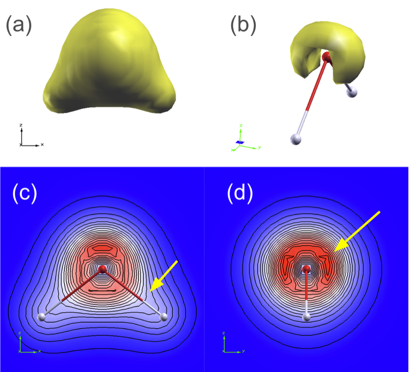
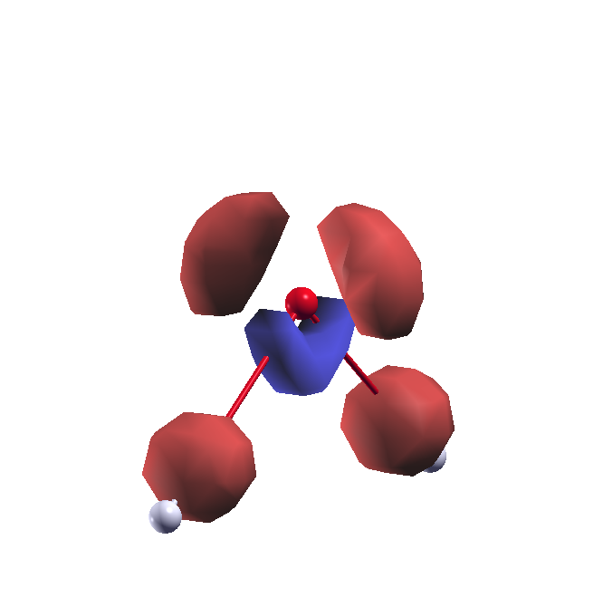

# Charge density

In this tutorial we will compute charge density and dipole moment of the water molecule.

### Outline
1. Calculate and visualise the electronic charge density
2. Calculate a charge density difference
3. Calculate the dipole moment of water

### Running the exercise
For this tutorial we will work in the '3_charge_density' folder. From '2_geometry':
```
% cd ../3_charge_density
```

1. The file 'H2O.optimized.in' contains the final optimized geometry from the previous tutorial. Run an SCF calculation to compute the ground state charge density:
```
% pw.x < H2O.optimized.in >  H2O.optimized.out
```
If you look in the 'tmp/H2O.save' folder you will discover a file called 'charge-density.dat'. However, this file is unformatted and cannot be viewed directly.

2. We will use one the main QE postprocessing code `pp.x` to extract information from this file and export it in a form suitable for plotting. The documentation for `pp.x` is https://www.quantum-espresso.org/Doc/INPUT_PP.html 

Let's look at the input file:

```
% cat charge3D.in
&inputpp
  prefix="H2O"
  outdir="./tmp"
  filplot="charge.dat"
  plot_num=0
/
&plot
  iflag=3
  output_format=5
  fileout="charge_plot3D.xsf"
/
```
The `pp.x` code requests two NAMELISTS: the first (`&inputpp`) determines what quantity is to be plotted, and the second (`&plot`) determines the format of the output data. Here we select to plot the charge density `plot_num=0` and ask for the output as a 3D volumetric datafile in the 'XcrysDen Structure Format' (xsf) format. Run the code:
```
% pp.x < charge3D.in > charge3D.out
```
There is often no need to save the standard output from `pp.x` to disk but it can be useful to check. 



3. Now we have our plottable datafile we can view it with XCrysDen or VESTA. Note the new argument to `xcrysden`:
```
% xcrysden --xsf charge_plot3D.xsf
```
Once the ball-and-stick model has loaded, import the volumetric data via Tools > Data grid > OK 
There are 4 tabs: one for 3D isosurfaces, and three for rendering 2D planes (perpendicular to Z,Y,X axes).
The minimum (~0) and maximum (~1.2) value of the charge density is indicated. Input a suitable isovalue and click 'submit'. 
Find suitable values that allow you to identify the region of high density from the lone pairs on oxygen. What kind of geometry have the O orbitals?

For looking along a bond, a 2D slide can be more useful. Switch off the isosurface plot and select the tab for plane #2 (i.e. in the molecular plane). Use the arrows to shift the plane to cut the atom centre. You can change the colour-scheme and add isolines. 

Can you confirm that (1) the O-H bond is covalent; (2) the O-H bond is polar? 
Now select the tab for plane #3. Confirm the presence of the lone pairs on the O atom.

4. The total charge density itself can be diffiult to extract distinct features from. Often it is much more useful to view _differences_ in the charge density with respect to some reference. The `pp.x` code allows you to plot 
```
   9  = charge density minus superposition of atomic densities
```
Change the charge3D.in file in order to generate an approproate input, and plot the result. 
What do you understand from the output? (Hint: red means electron accumulation)



> [!TIP]
> Both 3D and 2D visuals are useful: learn to use them both.

### Dipole moment

5. Quantum-ESPRESSO includes some additional capabilities for treating isolated or low-dimensional systems to compute things like dipole moments. To compute the dipole moment of water we must explicitly use `ibrav=1` (simple cubic lattice) and ask to treat the system as truly isolated. Don't worry about the details, just note the differences in the 'H2O.optimized-dipole.in' file and run the calculation:
```
% cat H2O.optimized-dipole.in 
  [...]
  ibrav     = 1,
  A         = 8
  assume_isolated='makov-payne'
  [...]

% pw.x < H2O.optimized-dipole.in > H2O.optimized-dipole.out

% grep -A 20 "Dipole" H2O.optimized-dipole.out
```
Compare the computed dipole moment with the experimental value of 1.85 Debye for an isolated water molecule.

Note also this calculation tells us the _vacuum level_ is 0.234 eV. This will be useful for the next tutorial.

### Links
Input files for quantum-ESPRESSO are described in 
- [INPUT_PW](https://www.quantum-espresso.org/Doc/INPUT_PW.html) 
- [INPUT_PP](https://www.quantum-espresso.org/Doc/INPUT_PP.html) 

