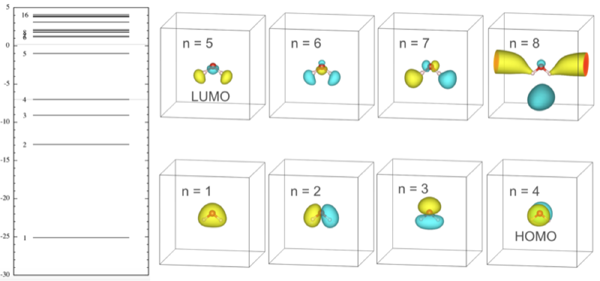

# Electronic states

In this tutorial we will compute the energy levels and plot the molecular orbitals of the water molecule.


### Outline
1. Compute energy levels
2. Calculate and plot the wavefunctions

### Running the exercise
Move to the '4_electronic_states' folder:
```
% cd ../4_electronic_states
```
1. We will use again the file 'H2O.optimized.in' to compute the SCF charge density. However, we also ask for 20 bands, i.e. 20-4=16 occupied states. In principle it is a waste of resources to use an SCF calculation to compute empty states, but since it is so quick here it is not a big problem. Run the SCF calculation:
```
% pw.x < H2O.optimized.in >  H2O.optimized.out
```
and look for the list of eigenvalues:
```
     End of self-consistent calculation

          k = 0.0000 0.0000 0.0000 ( 13601 PWs)   bands (ev):

   -25.0971 -12.8958  -9.0901  -6.9960  -0.9975   1.1612   1.2953   1.7890
     1.8103   2.0213   2.1064   3.1071   3.7917   3.8157   3.8865   4.0681
```
We want to plot these eigenvalues as a sequence of levels/horizontal lines. Unfortunately there is no simple/clear way to do this
. One way to it is to copy and paste the eigenvalues into a new file 'eigenvalues.dat' and move each entry onto a new line, like:
```
% cat eigenvalues.dat
 -25.0971 
 -12.8958 
 -9.0901
[...]
4.0681
```
and then plot these data with gnuplot using a headless 'arrow' style:
```
gnuplot> plot "eigenvalues.dat" using (0):1:(0.5):(0.0) with arrows nohead
```
(Don't worry about the details. The format (see 'help style arrow') means: (set x-coord=0):column 1 data:(length of line=0.5):(angle=0.0)")

Take note of where the HOMO level is (it is written in the SCF output file) and also the vacuum level (from the previous tutorial).



> [!TIP]
> You could alternatively plot the density of states, with some small broadening around each level. Try running `dos.x < dos.in` and plot the output file 'H2O.dos.dat'. 

### Running the exercise
2. Now let's generate the molecular orbitals for each of these levels. Inspect the 'states.in' file:
```
% cat states.in
&inputpp
  prefix="H2O"
  outdir="./tmp"
  filplot="psi2"
  plot_num=7
  kpoint=1
  kband(1)=1
  kband(2)=8
  lsign=.true.
/
&plot
  iflag=3
  output_format=5
  fileout=".xsf"
/
```
Look at https://www.quantum-espresso.org/Doc/INPUT_PP.html and try to understand the structure the file and the meaning of the variables.

```
% pp.x < states.in > states.out
```
We should now have 8 unformatted files (that you can delete) and 8 formatted .xsf files for plotting. Open the first with `xcrysden`:
```
% xcrysden --xsf psi2_K001_B001.xsf
```
Once the ball-and-stick model has loaded, import the volumetric data via Tools > Data grid > OK, and view the 3D isosurface.

Like in the charge density tutorial, find an appropriate isovalue (perhaps 10% of the maximum) and compare the result with the literature images at the top of this page. Repeat for the other 7 molecular orbitals ("bands").
Note that what is plotted here is |psi^2|, not |psi|. Nonetheless the 'lsign=.true.' flag allows the positive and negative lobes to be distinguished.

You might now try to answer:

- On what atom is the HOMO localized?
- Which state is associated with the O lone pairs?
- Which states are bonding/antibonding/nonbonding?
- What do you notice about the MOs above the vacuum level?

> [!TIP]
> You can also use the VESTA program to view .xsf (and .cube) files. It produces nicer images than XCrysDen. However, it cannot open PWscf input or output files.

### Links
Input files for quantum-ESPRESSO are described in 
- [INPUT_PW](https://www.quantum-espresso.org/Doc/INPUT_PW.html) 
- [INPUT_PP](https://www.quantum-espresso.org/Doc/INPUT_PP.html)  

For a detailed explanation of the molecular orbitals of the water molecule, read  
- [Bonding in H2O at chem.libretexts.org](https://chem.libretexts.org/Courses/Saint_Marys_College_Notre_Dame_IN/CHEM_431%3A_Inorganic_Chemistry_(Haas)/CHEM_431_Readings/06%3A_Using_Character_Tables_and_Generating_SALCS_for_MO_Diagrams/6.02%3A_Molecular_Orbital_Theory_for_Larger_(Polyatomic)_Molecules/6.2.03%3A_H2O)
- [Wikipedia entry](https://en.wikipedia.org/wiki/Chemical_bonding_of_water)

