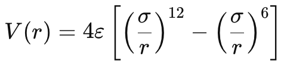
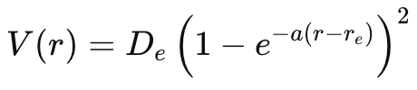
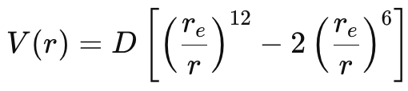

# CO dissociation potential

Now that we know better how to treat isolated atoms in DFT, we can extend our previous study of the dissociation potential and binding energy of the CO molecule by moving the atoms even further apart.

The dissociation curve can be described by an intermolecular pair potential. The most well known of these is the Lennard-Jones potential, which describes in a simple yet effective way the distance-dependent relation between two weakly interacting neutral entities. It is defined by a power law expression with exponents 12 (for the repulsive component) and 6 (for the attractive component).



The Lennard-Jones potential could be used to describe non-bonded interactions between CO molecules, or CO adsorption on a surface, or the long-range repulsion/attraction between atoms after the bond is broken.

Here however we have strong covalent bond within the CO molecule. Thus it is better to model the dissociation potential with e.g. the Morse potential. Like LJ, the Morse potential is anharmonic, thus can describe bond stretching and dissociation, and features an exponential form which better  models how the electron cloud (and bond strength) decays with distance.



## Purpose
  1. Calculate the potential curve between 2 atoms forming a chemical bond
  2. Model the bond dissociation with an appropriate semi-empirical formula.

## Running the exercise
  1. For this kind of systematic study, it makes much more sense to use a scripting tool. Nonetheless one must first decide how to treat in DFT both the bonded molecule (singlet) as well as the separated atoms (triplets). From the 3_binding tutorial, we learned that using spin+smearing allows a good approximation of the total energy for both kinds of system, even though not totally accurate. Thus, in our input file we use:
     ```
     % cat co.scf.in
     [...]
     nspin     = 2
     occupations ='smearing',
     degauss     =0.001,
     starting_magnetization(1)=0.1
     [...]
     CELL_PARAMETERS {angstrom}
     13.0  0.0  0.0
      0.0  8.0  0.0
      0.0  0.0  8.0
     ```
     For efficiency, we use a slightly smaller vacuum separation than our suggested 10A, but you can change this if you have the resources.

     First verify that the calculation will converge with this input file parameters at selected C-O distances of 1A, 2.5A, and 4 A, and inspect the occupations and total/absolute magnetization in each case.

  2. Now run the run_lj script to loop over a range of bond lengths, saving the bond length and magnetization each time.
     ```
     ./Scripts/run_lj
     ```
     Plot the created 'Etot_vs_bond.dat' datafile. Compare the dissociation energy with that computed in the 2_binding tutorial.

     Plot also the 'Mag_vs_bond.dat' file. Note there is a kind of transition between 2 and 3 A, where the system moves from singlet (CO molecule) to two triplets (separated fragments). However, LDA suffers from a gross delocalization error at large bond distances, so treat these results with skepticism! See Ref [1].

     Ref/plot_mag.png
     

  4. Next, we run a gnuplot script to fit to the Morse and Lennard-Jones potentials. Here in fact we will use a modified L-J potential of the form:


     

     See the 2_binding tutorial for how to fit functions to data in gnuplot; you may inspect Scripts/run_plots for details.
     ```
     ./Scripts/run_plots
     gnuplot> load "plot-script.gnu"
     gnuplot> load "plot-script-mag.gnu"
     ```
     
     

     It is clear that the LJ-like potential fails badly to simulate the CO dissociation, as expected. Instead, a satisfactory fit is found for the Morse potential.

     Instead of this modified LJ "6-12"-potential, you may try a similar function where the exponents are allowed to change from  from (12,6) to (2n,n). See 4_LennardJones.

## Advanced

  4. The above analysis was carried out with LDA (O.pw-mt_fhi.UPF pseudopotential). LDA is well know to overbind and to show poor long range behaviour. Repeat the simulation with a GGA pseudopotential like PBE, which should improve the binding energy somewhat.

  5. Extract fitting parameters and import them into a molecular dynamics code...or better, use Avogadro to run a simple MD simulation of C-O binding. Compare the bond distance with that found in DFT.

## Bibliography
1. Insights into Current Limitations of Density Functional Theory, Aron J. Cohen, Paula Mori-Sánchez, and Weitao Yang.  Science (2008) Vol 321, Issue 5890 pp. 792-794. [Link](https://doi.org/10.1126/science.1158722)
