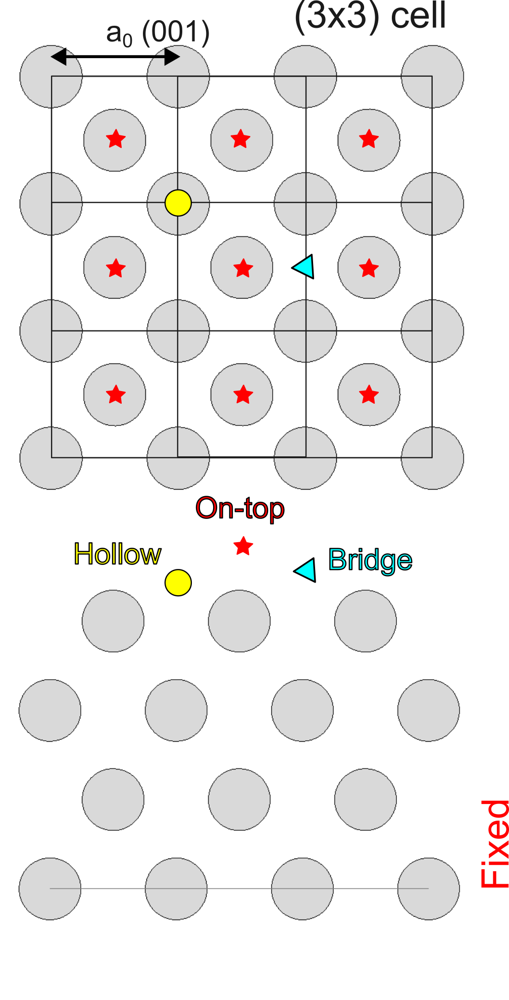

# Adsorption of O on Al(001): hollow and bridge sites

Using the strategies outlined for the on top site, we compute the adsorption energy for hollow and bridge site O adsorption.

## Input file

We will start from the relaxed coordinates of the Al(001) surface.

