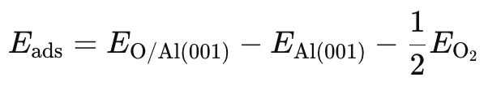
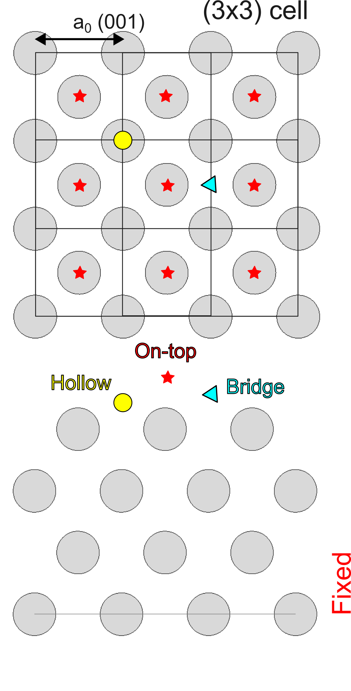
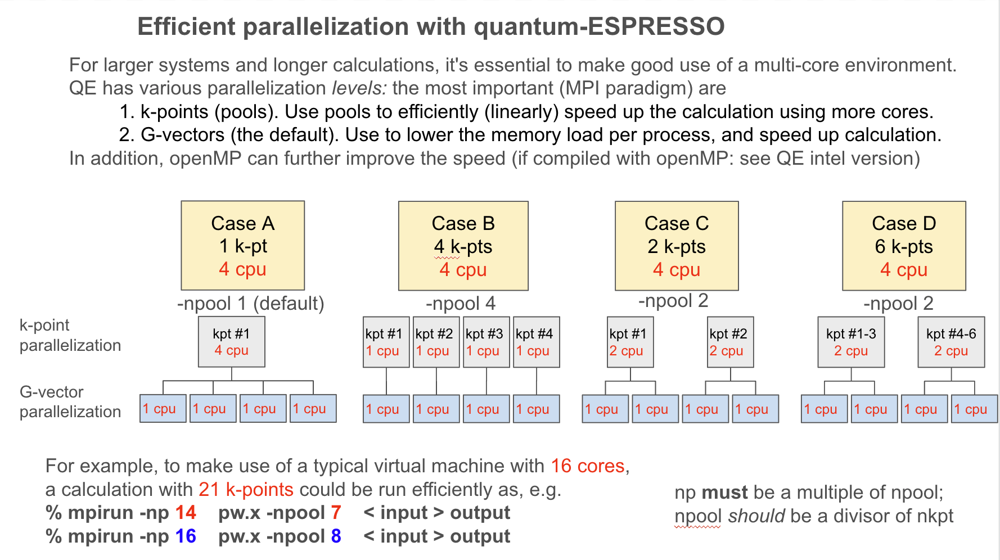
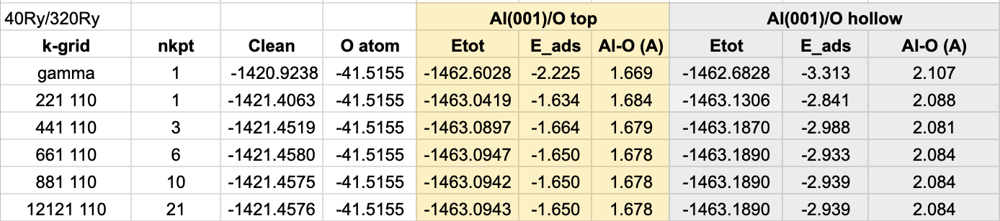

# Adsorption of O on Al(001): general strategies

Here we will compute the adsorption energy of an O atom on the Ag(001) surface.



When considering adsorption of oxygen, it is more common to compute the oxygen atom energy from that of the O2 molecule, since adsorption usually involved the molecular species.

Surface optimizations are slow calculations so it is important to identify a good strategy.


## Input file

We will start from the relaxed coordinates of the Al(001) surface. 
We add by hand an O atom in a chosen site. For simplicity, we will start with the on-top site.



Our choice of a (3x3) surface unit cell determines the coverage: we will let the O atom occupy only 1 of  9 possible sites, hence the coverage is 1/9 = 0.11 ML (monolayer). This value is relevant if we wish to compare with experimental adsorption or work function measurement. Here we are using a (3x3) cell for illustrative purposes only.

How high do we put the O atom? It is important to have a reasonable starting geometry - as close as possible to the final result! - otherwise the optimization can take a long time.
Hence we need an estimate of the Al-O bond distance. Looking at the literature, e.g. a study of Al2O3 [1], we estimate a range of 1.70-2.10A, depending on the coordination. 

Let's start then with an Al-O distance of 1.72A.
Recall `alat=2.8546`, thus we place the O atom about 0.61 alat units above an Al atom in the top layer.

   ```
   % cat al001_3x3_O-top.in_INITIAL
   [...]
   &SYSTEM
   nosym       = .false.  ! danger!
   ibrav       = 0,
   A           = 2.8546 
   nat         = 37,
   ntyp        = 2,
   ecutwfc     = 40.D0,
   ecutrho     = 320.D0,
   occupations = "smearing",
   smearing    = "marzari-vanderbilt",
   degauss     = 0.05D0,
   [...]
   Al   2.5000000   2.5000000   2.1566262  
   O    1.5000000   1.5000000   2.7600000  0 0 1    <- Fix O laterally
   K_POINTS {automatic}
   6 6 1 1 1 0   
   ```
Besides that, note that we take the same cutoff as oxygen - i.e., the largest cutoff of O (40Ry) or Al (20Ry), and the smearing chosen for Al(001).
We are now ready to compute the relaxed geometry.

### Parallelization



### Convergence with k-points

Now that you know how to make better use of the multi-core environment, compute the adsorption energy for the top site in an efficient manner. For instance:

   ```
   % mpirun -np 4 pw.x < al001_3x3_O-top.in >& al001_3x3_O-top.out_221110 &     <- Use 221 110 grid
   % grep Total al001_3x3_O-top.out_221110
   % vi al001_3x3_O-top.in                 <- increase to 441 110, read old charge density/potential
   % cat al001_3x3_O-top.in 
   [...]
    &ELECTRONS
     conv_thr    = 1.D-7,
     mixing_beta = 0.5D0,
     mixing_mode = 'local-TF' ,
     startingpot = 'file'            <- read from 221 110 calculation     
     startingwfc = 'atomic'          <- don't read as #nkpt will differ
   /
   % pw.x < al001_3x3_O-top.in      ^C      <- check quickly number of k-points (3)
   % mpirun -np 6 pw.x -npool 3 < al001_3x3_O-top.in > al001_3x3_O-top.out_441110
   ```
At each step compute the adsorption energy and check its convergence with k-points. Check also the Al-O bond distance. 
A spreadsheet can be useful to keep track of the various runs.

You should eventually obtain something like this:



Observations:
- While gamma and 221110 both use a single k-point, the gamma_only choice is significantly poorer. It would be better to run a first rough relaxation with 221110, and restart from there.
- Convergence is achieved for a 661110 grid (6 k-points)
- Hollow site is significantly more favoured over top site.
- The absolute value of E_ads varies a lot depending on the treatment of spin in the single atom.
- Take care when comparing with other works, for example 3.3 eV is reported for hollow site adsorption in [2]. Discrepancies arise in many places: spin, number of slab layers, pseudopotential, etc.


[1] M. Young et al, ACS Appl.Mater. Interfaces 2020,12, 22804−22814
Probing the Atomic-Scale Structure of Amorphous Aluminum Oxide Grown by Atomic Layer Deposition

[2] G. G. Khan et al, Journal of Physics and Chemistry of Solids 70(2):298-302
Ab-initio pseudopotential study of electronic structure and chemisorption of oxygen on aluminium surface
DOI: 10.1016/j.jpcs.2008.10.017
