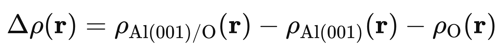

# Chemical bonding analysis: charge and potential

In this tutorial we examine some ways to analyse the chemical bond between the O atom and the Al(001) surface. In particular we will focus on analysing the electronic charge density.

Before continuing, let's regenerate the ground state charge density for the converged geometry and parameters.
We use a 6x6x1 k-point grid corresponding to 6 k-points, thus on a 16-core machine:
   ```
   % mpirun -np 12 pw.x -npool 6 < al001_3x3_O-top.in >& al001_3x3_O-top.out &
   % ls tmp/Ag.save
   Al.pbe-n-kjpaw_psl.1.0.0.UPF	paw.txt		    wfc1.dat ... wfc6.dat   
   O.pbe-n-kjpaw_psl.0.1.UPF	
   charge-density.dat		data-file-schema.xml		
   ```
This SCF run can take 5-10 minutes. Make sure the calculation is complete before continuing.

### Electrostatic potential

Let's start by looking at the planar-averaged electrostatic potential. As before, use `pp.x` and `average.x`.
   ```
   % pp.x < pp_pot.in
   % average.x < average_pot.in
   % mv avg.dat avg_pot_Al001_O.dat        <- NB later runs of average.x will overwrite "avg.dat"
   % gnuplot
   gnuplot> plot "avg_pot_Al001_O.dat" t "Average" w l,"" u 1:3 t "Macroscopic average" w l
   ```


We note several things:

- There is a gradient in the vacuum region. This is because the slab with oxygen on one side is now polar, and there is a long range dipolar interaction between images. This could effect some properties! We could mitigate it by increasing the vacuum size (with a penalty of slower calculation), by using a (thicker) symmetric slab with O on both sides, or by implementing a dipole correction in the vacuum (see keyword `dipfield`).
- The potential from the O atom is hardly visible (see the arrow) due to the averaging process across 3x3 cells.
- The potential in the Al layers is not precisely constant, indicating our slab is not really thick enough.
- By applying a second averaging step (the window size is defined in the last line of `average_pot.in`) we can determine the average value of the electrostatic potential (i.e. the macroscopic potential) inside the slab. This can be useful for aligning slab and bulk calculations.
- By comparing with the electrostatic potential of the clean surface, we can compute the work function change due to O adsorption (at 0.11ML coverage).

However, this analysis doesn't really help with understanding the chemical bonding.

### Charge density difference (CDD)

This is a very powerful technique for analysing and understanding bonding. In particular, it allows us to analyse the charge redistribution after a chemical bond or interaction is formed.



It is based on calculating the charge densities of the relaxed Al(001)/O system and of the A(001) and O atom in the same frozen geometries they have in the Al(001)/O case. The latter are called "peeled-off" geometries. In other words, for the peeled off Al(001) system, we take the converged Al(001)/O geometry, remove the O atom, and recompute the charge density (without relaxation).

For the difference calculation to work, the three calculations must be done in exactly the same way (cell, cutoff, k-points, etc). The atoms must be in the same positions, otherwise the Δρ will just show huge spikes due to the shift in the total atomic charge density!

It is highly important to do things neatly: use separate folders for the separate systems.

This process is subtly different from the adsorption energy calculation, which used the _relaxed_ Al(001) surface and an O atom (or O2 molecule) in a _cubic box_ as reference.

Let's calculate then the CDD as a difference in the planar averages and as a difference in the 2D densities: both are useful to understand the results. For reasons that will be clear later, we will call the input for `pp.x` "charge0.in", where 0 corresponds to the value of `plot_num` (valence charge density).

   ```
   % cat charge0.in
   &INPUTPP
      prefix       = "Al",
      outdir       = "./tmp",
      plot_num     = 0
      filplot      = "Al001_O_charge.dat"
   /
   &plot
     iflag=3
     output_format=6
     fileout="Al001_O_charge.cube"
   /
   % pp.x < charge0.in
   [...]
   Writing data to file  Al001_O_charge.dat
   Reading data from file  Al001_O_charge.dat

   Writing data to be plotted to file Al001_O_charge.cube
   Plot Type: 3D                     Output format: Gaussian cube
   ```
The _unformatted_ charge density is written to "Al001_O_charge.dat", and the _formatted_ charge density is written to "Al001_O_charge.cube". The latter is an alternative file format to XSF, it can be opened for instance with VESTA (`% VESTA Al001_O_charge.cube`)

Using `average.x` we compute the planar average of the _charge density_, reading the "Al001_O_charge.dat" file.
   ```
   % average.x < average_charge.in
   % mv avg.dat avg_Al001_O.dat
   ```
Now, we do the same for the two peeled off systems. Obviously, we have to do an SCF run first in each case.
   ```
   % cd O_peeled
   % mpirun -np 4 pw.x < O_peeled.in > O_peeled.out
   % pp.x < charge0.in
   % average.x < average.in
   % mv avg.dat avg_O.dat
   %
   % cd ../Al001_peeled
   % mpirun -np 6 pw.x -npool 6 < al001_peeled.in > al001_peeled.out
   % pp.x < charge0.in
   % average.x < average.in
   % mv avg.dat avg_Al001.dat
   ```
Yes - it's bit tedious, just take your time. Now we collect the data and compute the difference. Let's do this in a separate folder. Use the UNIX command `paste` to collect the three avg.dat files together, and use `awk` to select the columns we want:
   ```
   % cd ../Charge_difference
   % paste ../avg_Al001_O.dat ../Al001_peeled/avg_Al001.dat ../O_peeled/avg_O.dat | awk '{print $1,$2,$5,$8,$2-$5-$8}' > avg_difference.dat
   % gnuplot
   gnuplot>
   ```


From our definition of Δρ, positive values will correspond to an accumulation of charge, and negative values to a depletion of charge.

Thus: we observe
   - Charge depletion around the Al atom
   - Charge accumulation between Al and O, suggestive of covalent bonding
   - A net charge transfer from Al to O, consistent with the higher electronegativity of O
   - Formation of a dipole perpendicular to the surface  

We can get a more complete understanding by looking at the charge redistribution in 3D. The three charge densities in real space have already been computed, we just need to carry out the subtraction in some way. Fortunately it is straightforward to do this in quantum-ESPRESSO.
   ```
   % cat chargediff.in
   &INPUTPP
   /
   &plot
     nfile=3
     filepp(1)="../Al001_O_charge.dat"
     filepp(2)="../Al001_peeled/Al001_charge.dat"
     filepp(3)="../O_peeled/O_charge.dat"
     weight(1)=1.0                  <:   +ρ(Al001_O)
     weight(2)=-1.0                 <:   -ρ(Al001)
     weight(3)=-1.0                 <:   -ρ(O)
     iflag=3
     output_format=5
     fileout="chargediff.xsf"
   /
   % pp.x < chargediff.in
   [...]
        MPI processes distributed on     1 nodes
     Reading header from file  ../Al001_O_charge.dat
     Reading data from file  ../Al001_O_charge.dat
     Reading data from file  ../Al001_peeled/Al001_charge.dat
     Reading data from file  ../O_peeled/O_charge.dat

     Writing data to be plotted to file chargediff.xsf
     Plot Type: 3D                     Output format: XCrySDen

   % xcrysden --xsf chargediff.xsf      <- isovalue of e.g. 0.05
   ```


Thus we confirm the charge depletion is centred around one Al atom, and slightly elongated along the Al-Al axes. For the on-top site, this is somewhat banal - a similar analysis should be more interesting for the hollow site. Try it!

### Charge transfer and Bader charges

The only thing that is missing is a numerical estimate of the charge transfer. We should integrate the charge density around the adsorbed O atom and compare with the value for the isolated atom (6 electrons, obviously). But this introduces a new problem. How to define the volume around the O atom? How to partition the charges? One could take the midpoint of the Al-O bond, but what about a hollow site adsorption? And what about the higher electronegativity of O?

Indeed there are many ways to partition the charge: Atoms-in-molecules, Hirshfeld, Voronoi, formal charges, DDEC, etc... Here we will use the well-known AIM scheme of Bader ("Bader charges"), which is based on the charge density. Quoting from the Henklemann site: "Bader uses what are called zero flux surfaces to divide atoms. A zero flux surface is a 2-D surface on which the charge density is a minimum perpendicular to the surface. Typically in molecular systems, the charge density reaches a minimum between atoms and this is a natural place to separate atoms from each other."

Two codes that offer this analysis (and more) are `bader` and `critic2`.
The ingredients are the same: we need the valence charge density (`plot_num=0`) but also the PAW all-electron charge density (`plot_num=21`) as a reference to allow the atomic volumes to be defined. 
Note that this method requires a very dense real space (FFT) grid, so one should perform a convergence with `nr1, nr2, nr3`.

Taking the Bader code, the output file "ACF.dat" contains the atomic charges.

    ```
    % pp.x < charge0.in          <- already done above
    % pp.x < charge21.in 
    % 
    % bader Al001_O_charge0.cube -ref Al001_O_charge21.cube
    % 
    % cat ACF.dat 
           #         X           Y           Z       CHARGE      MIN DIST   ATOMIC VOL
    --------------------------------------------------------------------------------
       1   16.183237   16.183237   43.155298    2.858544     2.377244   497.997653
       2   16.183237    5.394412   43.155298    2.971628     2.377255   501.735615
    [...]
      32    8.091618    8.091618   11.088886    2.080497     0.649342    80.792968    <- Al (top)
    [...]
      36   13.479400   13.479400   11.633543    2.978900     2.426442   433.333846
      37    8.091618    8.091618   14.260430    7.629474     2.176960  1904.246603    <- O
       --------------------------------------------------------------------------------
       VACUUM CHARGE:               0.0000
       VACUUM VOLUME:               0.0000
       NUMBER OF ELECTRONS:       113.9994
    ```
Note that O is #37, and the Al atom directly underneath is #32.

Thus O has accepted 7.63-6.00=1.63 electrons from the surface, most of which is coming from the Al atom bonded to it (3.00-2.08=0.92e).

It is interesting to view the shape of the integration volumes:

   ```
   % bader -p sum_atom 37 charge0.cube -ref charge21.cube
   ```

