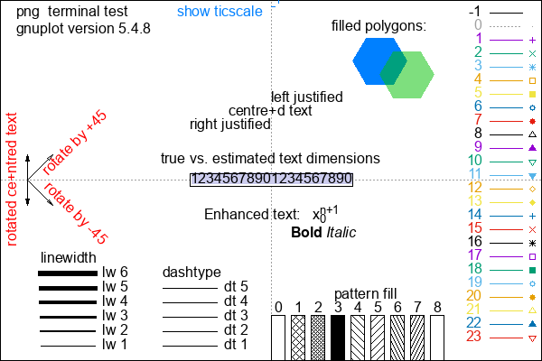
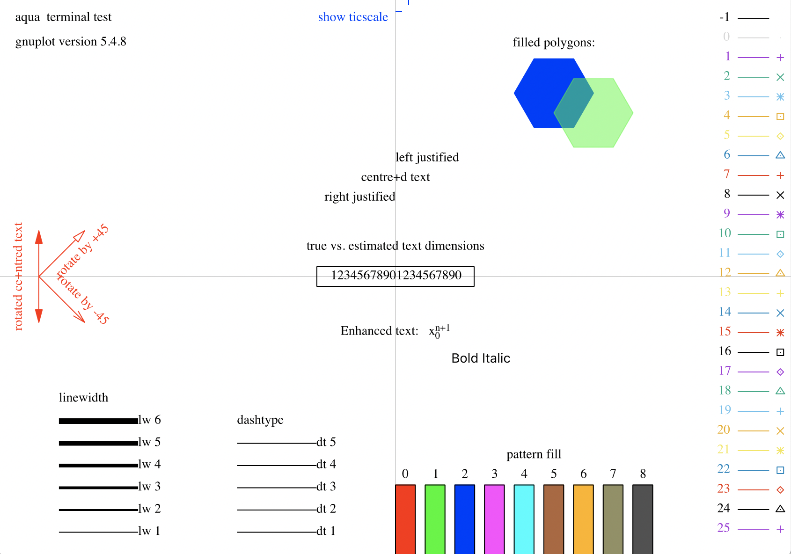
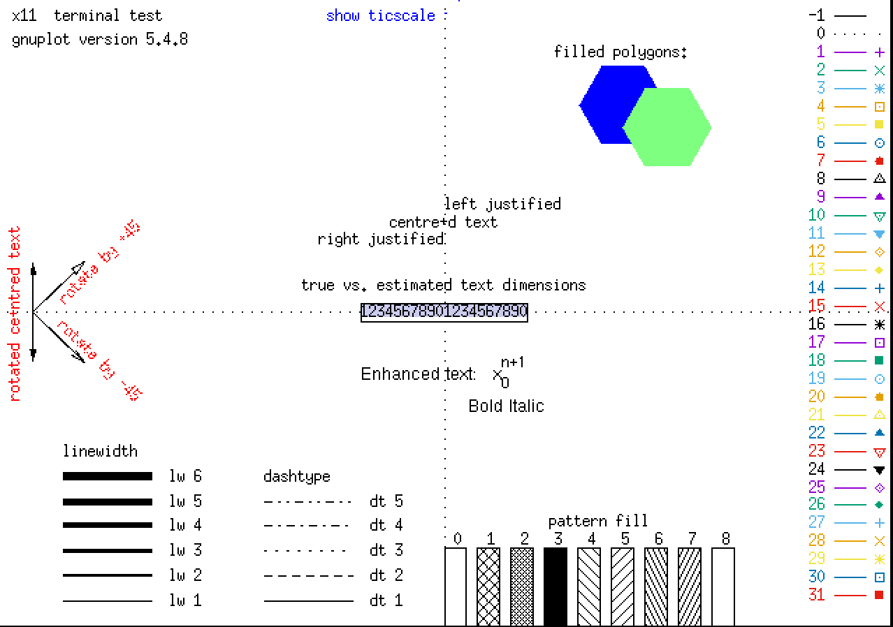

# Plotting data with gnuplot
This is a short (but dense!) tutorial for plotting scientific data with gnuplot. Gnuplot is a command-line-driven graphical program for generating 2D and 3D plots of functions and data, and particularly adapted for a Unix environment. It is extremely powerful and versatile but not as simple to use as a GUI software. 

The official website is http://www.gnuplot.info/ and is worth visiting as it contains many excellent resources such as links to complete books, documentation and demos.


## Setting up
You need to have installed a working modern version of gnuplot (>=5.0). Gnuplot can be installed through the usual unix package managers `sudo apt-get install gnuplot` or `sudo apt install gnuplot`, macports `sudo port install gnuplot`, homebrew `brew install gnuplot`, etc, or compiled from source (for the brave).
If you have problems with the display/windows, try installing a specific variant/flavour. I like the graphics generated by the cairo package, for which extra libraries need to be installed. Some possibilities for installation are:
```
Linux
% sudo apt-get install gnuplot 
% sudo apt-get install gnuplot-x11 
% sudo apt-get install gnuplot-qt
% sudo apt-get install libcairo2-dev libpango1-dev libx11-dev libpango-dev
Mac OS/X
% brew install aquaterm --cask
% brew install gnuplot --with-aquaterm --with-qt5

```
Once installed, just launch the program from the command line.
```
% gnuplot

G N U P L O T
Version 5.4 patchlevel 8    last modified 2023-06-01

Copyright (C) 1986-1993, 1998, 2004, 2007-2023
Thomas Williams, Colin Kelley and many others

gnuplot home:     http://www.gnuplot.info
faq, bugs, etc:   type "help FAQ"
immediate help:   type "help"  (plot window: hit 'h')

Terminal type is now 'aqua'
gnuplot>
```
If the terminal type remains undefined, there is some problem with the installation. On my macbook the default is `aqua`; if you installed `gnuplot-x11`, you can try
```
gnuplot> set terminal x11 enhanced
Terminal type is now 'x11'
Options are ' nopersist enhanced'
```

Assuming you have a working installation, you can now generate your first simple plot. 
In the rest of this page, click `What we learn here` for a longer explanation of the input commands.
```
gnuplot> set title "My first plot"
gnuplot> plot x**3,x**2
```


<details>

<summary>What we learn here (click to expand)</summary>

* Terminal types (type "help terminal" for more information)
* Define a graph title (set xlabel "...")
* Plot two simple functions on the same graph (simply separate by comma)

</details>

The colours and fonts will differ for you. Here I am using `pngcairo` style.


## Plot styles

Now we move to a more useful example. Here on we will drop the `gnuplot>` prompt for clarity.
```
set title "Basic functions and styles"

set xlabel "X-axis label"
set ylabel "Y-axis label"
set y2label "Second Y-axis label "

set yrange [-5:10]
set ytics 4 nomirror
set y2range [-20:20]
set xrange [-10:5]
set mxtics 5

my_variable=-3
f(x)=x
set key top left
plot sin(x)+exp(x) title "sine+exp" with lines dashtype 2,\
    x**2 t "x^2" w lp lt 1 linewidth 2 linecolor "red",\
    f(x-2),\
    my_variable 

```


<details>

<summary>What we learn here (click to expand)</summary>

* Set primary and secondary axes labels (set xlabel "...")
* Set axis ranges (set xrange [min:max])
* Major tics spacing (set xtics 0.5) and minor tic frequency (set xtics 5) and their mirroring
* User-defined variables and functions
* Plot mathematical functions (sin(x)) and horizontal lines (my_variable, or just the number directly)
* Enhanced text formatting (x^2, x_2 for super/subscripts etc) 
* Line styles: types, dashes, widths, colours, and abbreviated forms (title/t, with/w, linespoints/lp, linewidth/lw, linecolor/lc)
* Line breaks (last character on line MUST be a backslash)

</details>

> [!TIP]
> Type "help [topic]" from inside gnuplot to access the exhaustive gnuplot manual, e.g. "help plot" or "help xtics" or "help set" 

## Saving and loading scripts, generating images

Once you've created and customized your plot, you can save the settings to a file (a script) with `save`. From the gnuplot prompt you can then exit to the shell by prepending `!` to a command, perhaps edit the newly created file (e.g. with vi), before using `load` to read the script and generate the plot again. You can use a suffix like .gnu or .gpt to identify the script as being gnuplot format.
```
gnuplot> save "my_nice_graph.gnu"
gnuplot> !vi my_nice_graph.gnu
gnuplot> load "my_nice_graph.gnu"
```
A script file generated in this way is very long as it lists all the default variables and settings. You can edit the variables as you find them in the script, or just add your changes to the end of the file (thus overwriting default/saved options). You can also simply make a short script containing just the commands you wish:
```
% cat a_simple_script.gnu
#!/usr/bin/gnuplot
# This is a short gnuplot script. 
set xrange [-pi:pi]
a=1.5
f(x)=a*exp(-x**2)
plot f(x) title "a x e^(-x^2)"
%
```

To generate a actual image file like a png or eps, you need to modify both the `terminal` and the `output`. Typically inside a script one generates first a bitmap file and then replots to the screen, so that the outcome can be seen immediately when you load the script from inside gnuplot.
```
set terminal pngcairo enhanced size 600,400
set output "my_nice_graph.png"
plot sin(x),x**2   # Creates the png
set term x11 enhanced  
set out     # Resets the output to the screen
replot      
```
The image formats available will depend on your installation. Run `help terminal` for a list, including png, postscript, svg, etc. More advanced users might export to LaTeX.

You can also just run `% gnuplot my_nice_graph.gnu` directly from the unix shell. In this case you certainly want to direct the output to an image.

## Plotting datafiles

We will plot the following simple datafile containing three columns:

```
% cat my_datafile.dat
#A comment ignored by gnuplot starts with '#'
0 0 0.5
1 1 0.5
2 3 1.0
4 -1 0.2 # another comment
3 1 0.2
```

We can plot the contents of the file by using directly the filename with the plot command, or by defining a variable:
```
FILENAME="gnuplot3.dat"

set title "Plotting datafiles"
set xlabel "Default number style: 1 or 1.5"

plot "gnuplot3.dat" with lines,\
        "gnuplot3.dat" using 3:1,\
        "" u 1:2:($3*3) with points pointsize variable pointtype 6,\
        FILENAME u 1:($2*2+0.2*$1) w lp pt 7 ps 2.0
```


<details>

<summary>What we learn here:</summary>

* Define a string as a variable (VAR="name")
* Note the way decimals are show by default (1 or 1.5)
- Plot an external file (plot "file.dat"). 
- Default: first column = abscissa (x-axis); second column = ordinate (y-axis)
- Repeat the previous filename (plot "")
- Select different columns to plot (using 3:1) or (u 3:1)
- Use additional columns to control the plot style (variable). The order is (help variable):
```
plot DATA using x:y:pointsize:pointtype:color \
           with points lc variable pt variable ps variable
```
- Plot a file using a string variable
- Manipulate (scale, shift) data to be plotted. The value of data in e.g. column 2 is $2 [plot "" using ($1+10):($2**2)]

</details>


## Graph styling: Axes, tics, labels, key
Here we illustrate how to fine-tune various aspects of the graph style.

```
set term x11 enhanced
set encoding utf8
set xlabel "Label with Times,20pt font" font "Times,20"
set ylabel "Label with Helvetica,12pt font" font "Helvetica,12"
set label 1 "Rotated\n text" at 3,2 rotate by 30
set label 2 "UTF8 special chars (Å,±,ρ)" at 1,-5
set label 3 "Hide me!"
unset label 3
set arrow 1 from -2.5,-2.5 to screen 0.25,0.75 lc "red" lw 2
min=-10
max=10
set yrange [min:max]
set xtics 2.5
set arrow 10 from 0,min to 0,max nohead
set label 4 "Vertical line" at -0.5,(max+min)/2 rotate by 90 
set format x "%4.1f"
set format y "%g"
set key above Right 
set key box samplen 10 
plot x t "f(x)=x" dt 5 lw 2
```


<details>

<summary>What we learn here:</summary>

* Specify font styles and sizes
* Index, position and rotate labels
* Draw arrows using absolute coordinates (x,y) or screen (or graph) coordinates (0,1)
* Draw vertical lines
* Use variables in positioning and ranges
* Control the formatting of floating point numbers (set format %4.1f)
* Move and modify the key/legend ("help key" for more options)

</details>

> [!TIP]
> Special characters can be used directly with utf8 encoding. Just copy and paste: Å ± ∥ α β ρ χ Γ Δ ∞ √ ⨉ × −
> Search in https://www.fileformat.info/info/unicode/char/search.htm for other possible characters.

## Multiple datasets and conditional plotting
Different datasets are separated by two blank lines. A single blank line indicates a break in a single dataset.
```
% cat multidata.dat
#A comment ignored by gnuplot starts with '#'
#First set of data (index 0)
0 0 0.5
1 1 0.5
2 3 1.0

#Second part of first set 
3 1
4 2
5 3


#Second set of data follows two empty lines (index 1)
0 -1
1 -2
2 -1
3 -2
4.5 -3
```

```
set xtics 1 out nomirror
set grid x
set mxtics 2
set ytics 1 in nomirror
set mytics 4
set border 3
set yrange [-4:4]
plot "multidata.dat" index 0 using 1:2 with lp lc "black" pt 6 ps 2.0,\
        "" i 1 with filledcurves y=-1 fillstyle lc "red" fillcolor "forest-green",\
        "" i 0 u 1:($1 <= 1 ? $2 : 1/0) with filledcurve x1 fillstyle transparent solid 0.5 fillcolor "orange"
```


<details>

<summary>What we learn here:</summary>

* Remove parts of the border and related mirrored tics (help set border)
* Plot selected datasets (index 0 is the first)
* Filledcurves and fillstyle, transparency
* Ternary operators for conditional plotting (`gnuplot> help ternary`). Here "using 1:($1 <= 1 ? $2 : 1/0)" means: if the data in column 1 ($1) is less than or equal to 1, then do plot using 1:2, otherwise skip that point (1/0 is undefined).

</details>

## Terminal styles, export images
You can use the `test` function inside gnuplot to see what line style defaults your current terminal produces. The column on the far right, for example, shows what `with lines linetype N (w l lt N)` or `with points pointtype N (w p pt N)` produces for a particular value of N.
```
gnuplot> test
```

<p float="center">
  
   
</p>
<p float="center">
  
   
</p>

## Curve fitting, smoothing

## Multiplot

## Other documentation and resources 
There is a huge amount of more detailed documentation, tips, examples, of gnuplot available on the internet. 

*Complete websites*
* http://www.gnuplot.info/documentation.html 
* https://gnuplotting.org/

*Books*
* https://alogus.com/g5script/gnuplot5/
* https://www.manning.com/books/gnuplot-in-action-second-edition

*Video tutorials*
* https://www.youtube.com/playlist?list=PLAiKNYrUqmyKvRtKRYaZ6Ylwcj977r0lw

*Miscellaneous blog posts, articles, websites, tutorials.* 
Some older info refers to gnuplot 4.0; many tips and tricks are obsolete with functionality of gnuplot 5.x.
* http://lowrank.net/gnuplot/intro/index-e.html
* https://lwn.net/Articles/628537/  
* https://pranabdas.github.io/linux/gnuplot/
* http://www.phyast.pitt.edu/~zov1/gnuplot/html/intro.html
* http://personalpages.to.infn.it/~mignone/Numerical_Algorithms/gnuplot.pdf
* https://gnuplot-tricks.blogspot.com/

