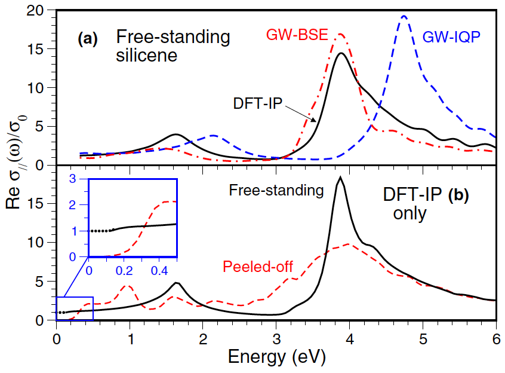
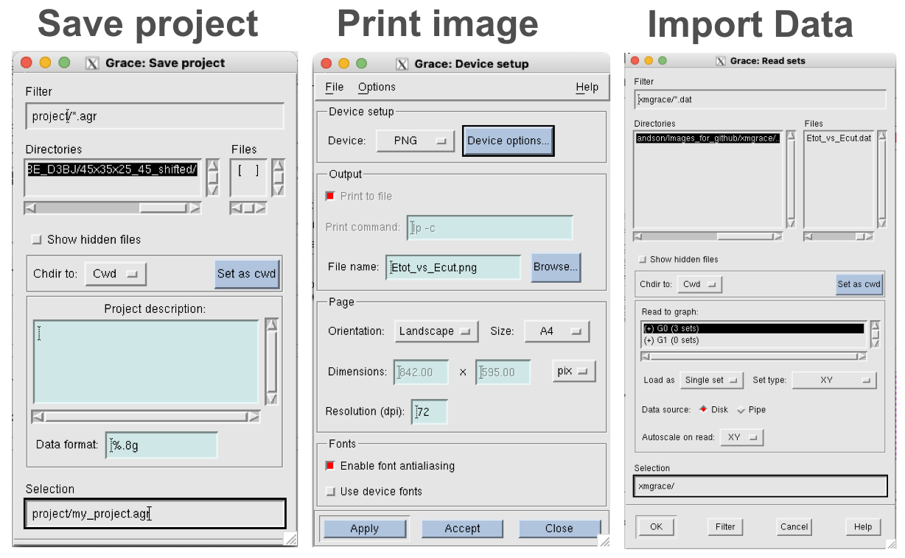
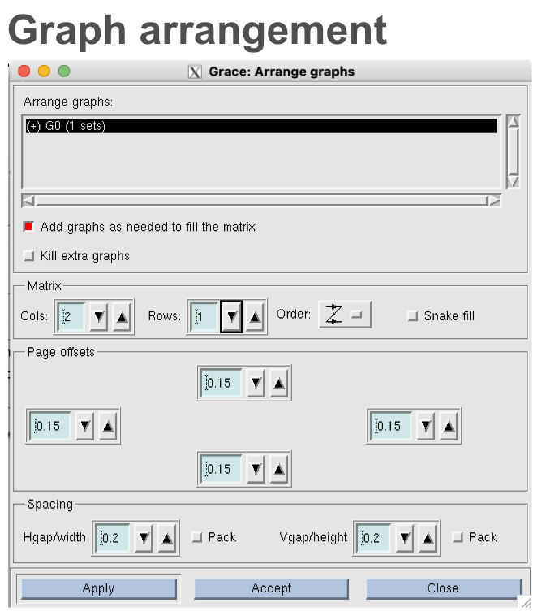
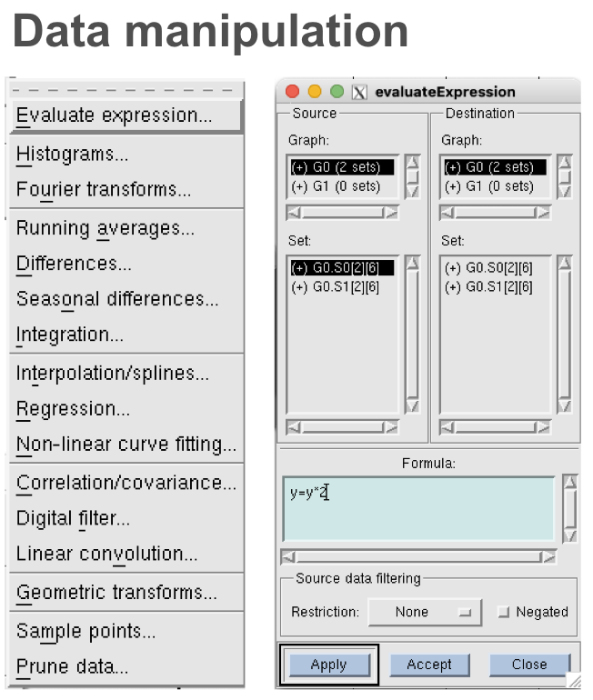
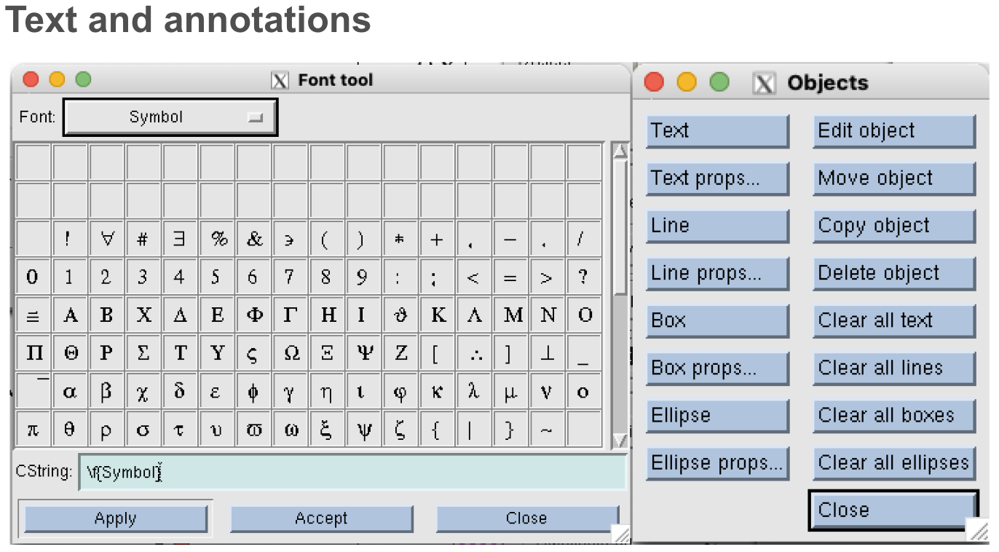

# Plotting data with grace
This is a short tutorial for plotting scientific data with grace (xmgrace). Grace is a WYSIWYG graphical program for generating 2D plots of functions and data. Although it is somewhat old, it is still a solid plotting tool for use in a Unix environment, and easier to pick up than say gnuplot or the python-based matplotlib. The curve fitting and multipanel plotting is very nice to use.



An example of a two-panel figure created using Grace.

The official website is https://plasma-gate.weizmann.ac.il/Grace/ in which you will find the offical [User Guide](https://plasma-gate.weizmann.ac.il/Grace/doc/UsersGuide.html) and [Tutorial](https://plasma-gate.weizmann.ac.il/Grace/doc/Tutorial.html). Here is the [Tutorial PDF](Ref/vigmond_xmgrace_tutorial.pdf ) and a very nice [physics tutorial PDF](Ref/grace_tutorial_2024.pdf) downloaded from [here](https://hogan53.net/common_pdfs/grace_tutorial_2024.pdf).

## Main window
Assuming you have the software installed, you can launch it in different ways:
```
% xmgrace			                    [open the default plot window]
% xmgrace Ref/example.agr	        [open a pre-existing project]
% xmgrace Ref/other_data.txt	    [read data from 2-column textfile]
% xmgrace -nxy Ref/other_data.txt [read data from a multi-column file]
```


The main window has some buttons on the left, the most useful being to autoscale axes. Typically however you will set ranges manually.


The main menus are accessible from the menu bar. Specific menus will also open automatically by clicking inside the canvas (on a datapoint, or a legend, etc). 

<details>

<summary>What we learn here (click to expand)</summary>

* Terminal types (type "help terminal" for more information)
* Define a graph title (set xlabel "...")
* Plot two simple functions on the same graph (simply separate by comma)

</details>

## Data import and export



From the `Data > Import > ASCII` option you can read data from a file. Typically grace will Filter files with `.dat` suffix but you can replace the '*.dat' with '*' to show all possible files. Click the desired file to update the Selection field.

Next, specify how the data is organized.
* Load a 'single set' of 2-column (X vs Y) data, or as multiple columns (X vs Y,Y2,Y3, etc) at once 'NXY'. More complicated sets of data can be fine-tuned using 'Block data', which will open up a further menu.
* Click the default 'XY' type to show a range of options including errors, bars, size, colours, etc.
* Decide whether to autoscale X and/or Y axes based on the imported dataset
* Accept to load the data, which will appear in a default style. The data will be named e.g. `[G0.S0]`, meaning set #0 in graph #0.

An existing 'project' can instead be loaded from disk using the `File > Open` option. A project file (suffix '.agr') will contain the plot style and settings as well as the data itself (making it very portable). Likewise, when you want to save a project, use `File > Save (As)`.

A figure can be printed to file (set the Device to PDF, PNG, etc) via the `File > Print setup` and then afterwards `File > Print` options. Also the size of the canvas (resolution) can be changed here.

## Graph appearance and style

The `Plot` drop-down menu contains the key options for styling the plot. `Plot > Plot appearance` allows only to change the canvas background (and put a timestamp). The Plot canvas can contain multiple Graphs.


`Plot > Graph appearance` allows the overall appearance of a single graph (within a multi-graph plot) to be modified, in particular graph titles and legend format and position.


`Plot > Set appearance` allows to change the style of separate datasets, i.e. lines, points, bars, etc.  


`Plot > Axis appearance` allows to change the axis ranges, labels, and tic marks. Make sure to select the desired axis before applying changes. 

> [!TIP]
> Save the .agr file often. There is no 'undo' function in xmgrace. However, you can easily 'Revert to saved'. 

## Advanced options


One of the true strengths of Grace is the ease of making and arranging multi-panel figures (multiple Graphs), which is very unsatisfactory in gnuplot.



`Edit > Arrange graphs` allows you to set up an array of graphs [G1...GN] to fill a plot and will automatically show or hide axis labels and tic labels if the panels are `packed`. Typically one ,ust work on one graph at a time, but there are options to apply axis properties to all graphs (handle with care). 



Grace includes a wealth of data transformation options. A quick and easy linear fit can be obtained with `Data > Transformations > Regression`, which creates a new set [S1] from a set [S0].



One of the weakest features of Grace instead is with text formatting, e.g. mixing Roman and Greek lettering. Nonetheless nice TeX-like results can be obtained. Grace uses the backslash character to escape between different fonts and modes. For example:
* H\s2\NO    [subscript \s...\N]
* E = mC\S2\N [superscript \S...\N]
* \xD\f{}E = \x{ab}/{c}\f{}dE [greek symbols \x...\f{}]
 
## Other documentation and resources 
There is not a huge amount of documentation available, but for basic operation the WYSIWYG layout is fairly self-explanatory. 

*Official website*
* https://plasma-gate.weizmann.ac.il/Grace/  

*Video tutorials*
* https://www.youtube.com/playlist?list=PLzSoIVVxSY_8KZ-Jra7GE3Czi6tu54TrJ


